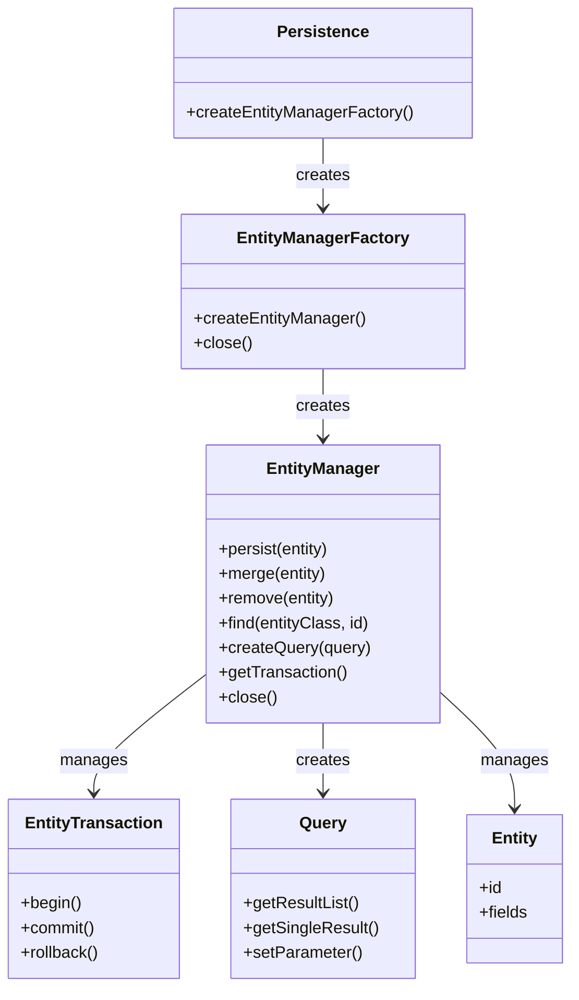
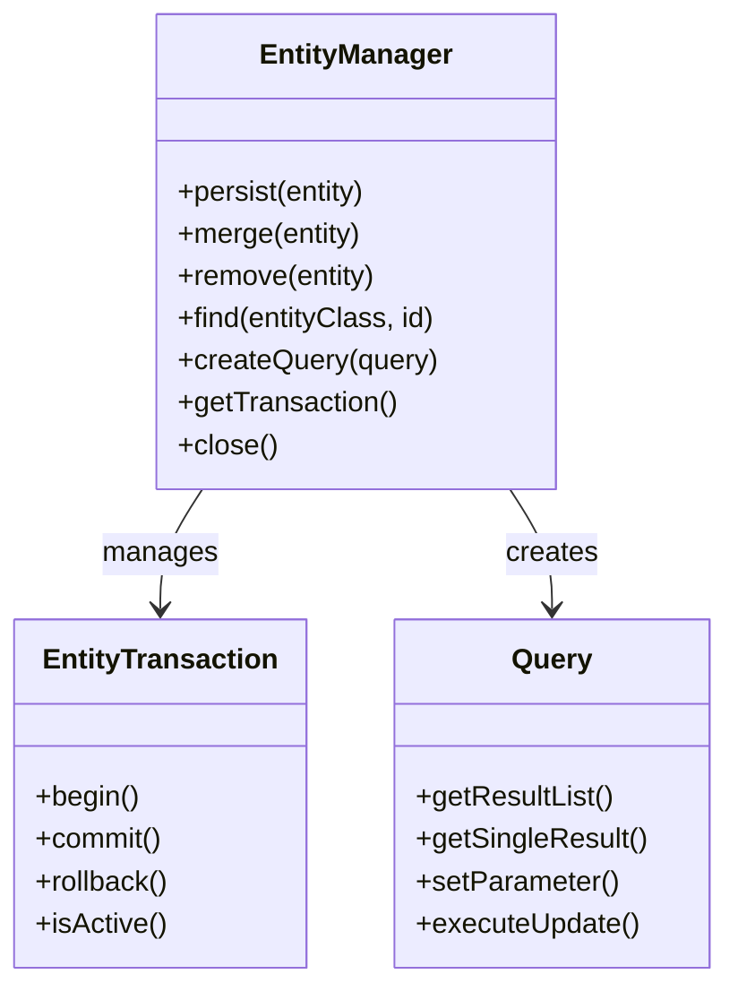

## Architechture Project

```
/src
  ├── controllers/
  │     ├── LoginServlet.java
  │     ├── LogoutServlet.java
  │     ├── ProductServlet.java
  ├── models/
  │     ├── User.java
  │     ├── Product.java
  ├── repositories/             //  Replace DALs (DAO)
  │     ├── UserRepository.java
  │     ├── ProductRepository.java
  ├── Utils/
  │     ├── JPAUtil.java        //  That is EntityManagerFactory
                                //  Replace DBContext.java
  ├── filters/
  │     ├── AuthFilter.java (lọc quyền truy cập)
  │
/webapp
  ├── META-INF/
  │     ├── persistence.xml     //  JPA Configuration
  ├── WEB-INF/
  │     ├── web.xml
  │     ├── tags/
  │     ├── layout.tag  
  ├── views/
  │     ├── login.jsp
  │     ├── home.jsp
  │     ├── product-management/
  │     │     ├── addProduct.jsp  
  │     │     ├── updateProduct.jsp  
  │     │     ├── listProduct.jsp
  │     │     ├── deleteProduct.jsp  
```

## Install JPA in Hibernate

Add dependencies into porm.xml in projects:

```xml
<!-- JPA API -->
<dependency>
    <groupId>jakarta.persistence</groupId>
    <artifactId>jakarta.persistence-api</artifactId>
    <version>3.1.0</version>
</dependency>

<!-- Hibernate Core -->
<dependency>
    <groupId>org.hibernate.orm</groupId>
    <artifactId>hibernate-core</artifactId>
    <version>6.3.0.Final</version>
</dependency>
```

> **Make sure** you have `Build with dependencies` **before running the project**

## 1. persistence.xml?

`persistence.xml` is the main configuration file used by JPA (Jakarta Persistence API) to define how your Java application connects to a database and manages entities.

It is typically placed inside:

```
src/main/resources/META-INF/persistence.xml
```

This file tells the JPA provider (such as Hibernate, EclipseLink, etc.):
- Which entities (models) to manage.
- How to connect to the database (JDBC settings).
- Which JPA provider and dialect to use.
- Optional settings like auto table creation, logging, caching, etc.

### 1.1 Persistence Unit

Inside persistence.xml, you define one or more persistence units — each representing a separate database configuration.

Each persistence unit is identified by a name:

```xml
<persistence-unit name="JSPShop">
    ...
</persistence-unit>
```

> Note: **name** of **persistence-unit**. That is a name which select in DBContext. **We need exact name.**

When your code calls:

```java
EntityManagerFactory emf = Persistence.createEntityManagerFactory("JSPShop");
```

JPA looks up the configuration with the name **JSPShop** from persistence.xml and uses it to connect to the database.

### 1.2 Example of persistence.xml in JSPShop:

Here’s a typical configuration using **Hibernate** with SQL Server:

```xml
<?xml version="1.0" encoding="UTF-8"?>
<persistence xmlns="https://jakarta.ee/xml/ns/persistence" version="3.0">
  <persistence-unit name="JSPShop">
    <!-- Register entity classes -->
    <class>Models.User</class>
    <class>Models.Product</class>

    <!-- Database connection properties -->
    <properties>
      <property name="jakarta.persistence.jdbc.driver" value="com.microsoft.sqlserver.jdbc.SQLServerDriver"/>
      <property name="jakarta.persistence.jdbc.url" value="<CONNECTIONSTRING>"/>
      <property name="jakarta.persistence.jdbc.user" value="<USER>"/>
      <property name="jakarta.persistence.jdbc.password" value="<PASSWORDS>"/>

      <!-- Hibernate properties -->
      <property name="hibernate.dialect" value="org.hibernate.dialect.SQLServerDialect"/>
      <property name="hibernate.hbm2ddl.auto" value="update"/>
      <property name="hibernate.show_sql" value="true"/>
      <property name="hibernate.format_sql" value="true"/>
    </properties>
  </persistence-unit>
</persistence>
```

You need to fill all SQL Server infomation same as DBContext:
- `<CONNECTIONSTRING>`: Connection String
- `<USER>` and `<PASSWORDS>`: User login into SQL Server.

### 1.3 Key Elements

| Tag / Property                               | Description                                                                 |
| -------------------------------------------- | --------------------------------------------------------------------------- |
| `<persistence-unit name="...">`              | Defines a configuration group for JPA. Each unit has its own DB connection. |
| `<class>`                                    | Lists all entity classes that should be managed by JPA.                     |
| `jakarta.persistence.jdbc.driver`            | The JDBC driver used to connect to the database.                            |
| `jakarta.persistence.jdbc.url`               | The database connection URL.                                                |
| `jakarta.persistence.jdbc.user` / `password` | Credentials for the DB connection.                                          |
| `hibernate.hbm2ddl.auto`                     | Defines schema generation strategy: `create`, `update`, `validate`, `none`. |
| `hibernate.show_sql`                         | Prints SQL statements in the console for debugging.                         |
| `hibernate.format_sql`                       | Formats SQL output for better readability.                                  |

Common `hibernate.hbm2ddl.auto` Values:

| Value         | Behavior                                                      |
| ------------- | ------------------------------------------------------------- |
| `create`      | Drops and recreates the database schema on every startup.     |
| `create-drop` | Creates schema at startup and drops it when the app stops.    |
| `update`      | Updates schema automatically to match entities (most common). |
| `validate`    | Checks that schema matches entities; throws error if not.     |
| `none`        | Does nothing (manual schema management).                      |

## 2. Introduction to JPA Entities

In JPA (Jakarta Persistence API), an Entity is a lightweight, persistent domain object that represents a table in a relational database.
Each instance of an entity corresponds to a single row (record) in that table.

An Entity is a POJO (Plain Old Java Object) class that is managed by the JPA provider and mapped to a database table through annotations or XML mapping.
It defines the structure of the data, including fields (columns), relationships, and metadata that describe how the object maps to the database.

**Keynotes:**

1. Annotated with @Entity: Declares that the class is a JPA entity and should be persisted to the database.
2. Has a Primary Key (@Id): Every entity must have a field that uniquely identifies it in the database.
3. Serializable and Public: Entities should be serializable and have a public or protected no-argument constructor.
4. Mapped to a Table (@Table): Optionally specifies the exact database table name. If omitted, the class name is used as the table name by default.
5. Fields Represent Columns: 
- Each attribute (field) corresponds to a column in the database.
- JPA automatically maps them, but you can override with @Column.
6. Can Participate in Relationships: Entities can be related to other entities (e.g., One-to-Many, Many-to-One) using JPA relationship annotations.

**Main materials:**



| Component                | Class / Annotation                                            | Purpose                                                                                              | Example / Notes                                                                                |
| ------------------------ | ------------------------------------------------------------- | ---------------------------------------------------------------------------------------------------- | ---------------------------------------------------------------------------------------------- |
| **Entity**               | `@Entity`                                                     | Represents a database table. Managed by Hibernate / Jakarta Persistence.                             | `@Entity class Product { ... }`                                                                |
| **EntityManagerFactory** | `jakarta.persistence.EntityManagerFactory`                    | Creates and manages `EntityManager` instances. Heavy resource; usually created once per application. | `EntityManagerFactory emf = Persistence.createEntityManagerFactory("unitName");`               |
| **EntityManager**        | `jakarta.persistence.EntityManager`                           | Manages entity instances; performs CRUD, queries, and transactions.                                  | `EntityManager em = emf.createEntityManager();`                                                |
| **EntityTransaction**    | `jakarta.persistence.EntityTransaction`                       | Manages transactions for write operations (persist, merge, remove).                                  | `EntityTransaction tx = em.getTransaction(); tx.begin(); ... tx.commit();`                     |
| **Persistence**          | `jakarta.persistence.Persistence`                             | Utility class to create `EntityManagerFactory` from `persistence.xml`.                               | `Persistence.createEntityManagerFactory("unitName");`                                          |
| **Query / TypedQuery**   | `jakarta.persistence.Query`, `jakarta.persistence.TypedQuery` | Create and execute JPQL/SQL queries.                                                                 | `Query q = em.createQuery("SELECT p FROM Product p"); List<Product> list = q.getResultList();` |

---
**How to update code-behide:**
- Step 1: Create `EntityManagerFactory`: Using `JPAUtil.java` instead of `DBConect.java`
- Step 2: Update `Entity` for `Models` by **anonymous parammeter** in `private variables`
- Step 3: Create `Repositories` pattern to contain data instead of `DALs`
- Step 4: Apply `Repositories` for `Servlets`.

### 2.1 EntityManagerFactory: JPAUtil.java (instead of DBConect.java)

- Class/Interface: jakarta.persistence.EntityManagerFactory
- Factory for creating EntityManager instances.
- Represents a persistence unit defined in persistence.xml.
- Heavy-weight object; usually created once per application and shared across multiple EntityManagers.

| Responsibility          | Description                                                                                             |
| ----------------------- | ------------------------------------------------------------------------------------------------------- |
| Create EntityManager    | Provides `createEntityManager()` method to create a new `EntityManager` (lightweight, short-lived).     |
| Manage persistence unit | Reads configuration from `persistence.xml`, including DB connection, JPA provider, and mapping classes. |
| Resource management     | Handles connection pools, caching, and other resources at the persistence unit level.                   |
| Thread-safe             | Can be safely shared across multiple threads, unlike `EntityManager` which is **not thread-safe**.      |

---
**The JPA-based equivalent, which replaces DBContext.java.**

```java
package Utils;

import jakarta.persistence.EntityManagerFactory;
import jakarta.persistence.Persistence;

public class JPAUtil {
    private static final EntityManagerFactory emf =
            Persistence.createEntityManagerFactory("JSPShop");

    public static EntityManagerFactory getEntityManagerFactory() {
        return emf;
    }

    public static void close() {
        emf.close();
    }
}
```

### 2.2 Update Models to an Entity ()

An Entity is a Java class annotated with `@Entity` that represents a table in the database. Hibernate or JPA manages its persistence.

Maps class fields to table columns, encapsulates business data, and interacts with EntityManager for CRUD and query operations.

| Feature                 | Annotation / Mechanism                                 | Description                                                               | Example                                                                         |
| ----------------------- | ------------------------------------------------------ | ------------------------------------------------------------------------- | ------------------------------------------------------------------------------- |
| **Primary Key**         | `@Id`, `@GeneratedValue`                               | Unique identifier of the entity. Can auto-generate values.                | `@Id @GeneratedValue(strategy = GenerationType.IDENTITY) private Long id;`      |
| **Columns**             | `@Column`                                              | Maps Java fields to DB columns. Supports length, nullability, uniqueness. | `@Column(name="product_name", nullable=false, length=100) private String name;` |
| **Relationships**       | `@OneToOne`, `@OneToMany`, `@ManyToOne`, `@ManyToMany` | Links entities together; supports cascading and fetching strategies.      | `@OneToMany(mappedBy="product") private List<Order> orders;`                    |
| **Transient Fields**    | `@Transient`                                           | Field not persisted in DB.                                                | `@Transient private int tempCalculation;`                                       |
| **Embedded Objects**    | `@Embedded`, `@Embeddable`                             | Reuse complex types or composite keys within the entity.                  | `@Embedded private Address address;`                                            |
| **Lifecycle Callbacks** | `@PrePersist`, `@PostLoad`, etc.                       | Execute custom logic at certain points of the entity lifecycle.           | `@PrePersist void setCreatedAt() { this.createdAt = LocalDateTime.now(); }`     |
| **Optimistic Locking**  | `@Version`                                             | Tracks entity version for concurrent updates.                             | `@Version private int version;`                                                 |
| **Named Queries**       | `@NamedQuery`, `@NamedQueries`                         | Predefined JPQL queries for reuse.                                        | `@NamedQuery(name="Product.findAll", query="SELECT p FROM Product p")`          |

---
**Entity Validation:**

| Feature                       | Annotation / Mechanism                   | Description                                       | Example                                                  |
| ----------------------------- | ---------------------------------------- | ------------------------------------------------- | -------------------------------------------------------- |
| **Not Null / Required**       | `@NotNull`                               | Field must not be null                            | `@NotNull private String name;`                          |
| **Not Empty / Not Blank**     | `@NotEmpty`, `@NotBlank`                 | String or collection must not be empty            | `@NotBlank private String description;`                  |
| **Size Constraints**          | `@Size(min=, max=)`                      | Restrict length of strings or size of collections | `@Size(max=100) private String title;`                   |
| **Number Constraints**        | `@Min`, `@Max`, `@Positive`, `@Negative` | Restrict numeric values                           | `@Min(0) @Max(1000) private int quantity;`               |
| **Pattern / Regex**           | `@Pattern(regexp="...")`                 | Field must match a regex pattern                  | `@Pattern(regexp="\\d{10}") private String phoneNumber;` |
| **Email / Format Validation** | `@Email`                                 | Validate email addresses                          | `@Email private String email;`                           |
| **Custom Validation**         | `@Constraint(validatedBy=...)`           | Implement custom validation logic                 | Custom `Validator` class for complex rules               |
| **Cascade Validation**        | `@Valid`                                 | Validates nested / embedded objects               | `@Valid @Embedded private Address address;`              |

---
**Update User Model (User.java)**

```java
package Models;

import jakarta.persistence.*;

@Entity
@Table(name = "Users")
public class User {

    @Id
    @GeneratedValue(strategy = GenerationType.IDENTITY)
    @Column(name = "UserID")
    private int id;

    @Column(name = "Username", nullable = false, length = 50, unique = true)
    private String name;

    @Column(name = "Password", nullable = false, length = 255)
    private String password;

    @Column(name = "Role", nullable = false, length = 20)
    private String role;

    public User() {
        this.id = -1;
        this.name = "";
        this.password = "";
        this.role = "";
    }

    public User(int id, String name, String password, String role) {
        this.id = id;
        this.name = name;
        this.password = password;
        this.role = role;
    }

    public int getId() {
        return id;
    }
    public void setId(int id) {
        this.id = id;
    }

    public String getName() {
        return name;
    }
    public void setName(String name) {
        this.name = name;
    }

    public String getPassword() {
        return password;
    }
    public void setPassword(String password) {
        this.password = password;
    }

    public String getRole() {
        return role;
    }
    public void setRole(String role) {
        this.role = role;
    }

    public static boolean isEmpty(User user) {
        return user == null || (user.getName() == null || user.getName().isEmpty());
    }
}
```

**Update Product Models (Product.java):**

```java
package Models;
import jakarta.persistence.*;

@Entity
@Table(name = "Products")
public class Product {

    @Id
    @GeneratedValue(strategy = GenerationType.IDENTITY)
    private int id;

    @Column(name = "name", nullable = false, length = 100)
    private String name;

    @Column(name = "description", columnDefinition = "TEXT")
    private String description;

    @Column(name = "price", nullable = false, precision = 10, scale = 2)
    private double price;

    @Column(name = "quantity", nullable = false)
    private int quantity;

    @Column(name = "image", nullable = false, length = 100)
    private String image;

    public Product() {
        this.id = 0;
        this.name = "";
        this.price = 0;
        this.description = "";
        this.quantity = 0;
        this.image = "";
    }

    public Product(String name, double price, String description, int quantity, String image) {
        this.name = name;
        this.price = price;
        this.description = description;
        this.quantity = quantity;
        this.image = image;
    }

    public Product(int id, String name, double price, String description, int quantity, String image) {
        this.id = id;
        this.name = name;
        this.price = price;
        this.description = description;
        this.quantity = quantity;
        this.image = image;
    }

    public int getId() {
        return id;
    }
    public void setId(int id) {
        this.id = id;
    }

    public String getName() {
        return name;
    }
    public void setName(String name) {
        this.name = name;
    }

    public String getDescription() {
        return description;
    }
    public void setDescription(String description) {
        this.description = description;
    }

    public double getPrice() {
        return price;
    }
    public void setPrice(double price) {
        this.price = price;
    }

    public int getQuantity() {
        return quantity;
    }
    public void setQuantity(int quantity) {
        this.quantity = quantity;
    }

    public String getImage() {
        return image;
    }
    public void setImage(String image) {
        this.image = image;
    }
}
```

### 2.3 Create Repositories Layer (replace DALs)

We can create a generic repository to handle any entity type:

| Component              | Definition / Role                                                                                                                         |
| ---------------------- | ----------------------------------------------------------------------------------------------------------------------------------------- |
| **EntityManager**      | Core interface in JPA to manage entities (CRUD, queries). Handles persistence context.                                                    |
| **EntityTransaction**  | Manages transactions for write operations (persist, merge, remove). Must begin/commit/rollback explicitly in RESOURCE_LOCAL transactions. |
| **Query / TypedQuery** | Used to create and execute JPQL or SQL queries. `TypedQuery<T>` is type-safe.                                                             |
| **Repository**         | Design pattern that abstracts persistence operations (CRUD and queries) into a reusable class. Encapsulates EntityManager logic.          |

Relationship:



#### 2.3.1 EntityManager:

- Class/Interface: jakarta.persistence.EntityManager

Using for:
- Core interface to manage entity instances.
- Performs CRUD operations, queries, and manages the persistence context.
- Not thread-safe, should be used per unit of work (e.g., per request).

| Method                                          | Purpose                                                 |
| ----------------------------------------------- | ------------------------------------------------------- |
| `persist(Object entity)`                        | Make a transient entity managed and schedule insert.    |
| `merge(Object entity)`                          | Merge detached entity into current persistence context. |
| `remove(Object entity)`                         | Mark entity for deletion.                               |
| `find(Class<T> entityClass, Object primaryKey)` | Retrieve entity by primary key.                         |
| `createQuery(String jpql)`                      | Create JPQL query.                                      |
| `getTransaction()`                              | Get the `EntityTransaction` to manage transactions.     |
| `close()`                                       | Close the EntityManager and release resources.          |

#### 2.3.2 EntityTransaction:

- Class / Interface: jakarta.persistence.EntityTransaction

Using for:
- Manage transactions for write operations (persist, merge, remove).
- Each EntityManager has its own EntityTransaction.

| Method       | Purpose                                  |
| ------------ | ---------------------------------------- |
| `begin()`    | Start a transaction.                     |
| `commit()`   | Commit changes to the database.          |
| `rollback()` | Rollback transaction if an error occurs. |
| `isActive()` | Check if transaction is active.          |


#### 2.3.3. Query/TypedQuery

- Classes/Interfaces: jakarta.persistence.Query, jakarta.persistence.TypedQuery

Using for:
- Execute JPQL (Java Persistence Query Language) or native SQL queries.
- Retrieve single or multiple entities.
- TypedQuery<T> provides type-safe query results.

| Method                                    | Purpose                                                    |
| ----------------------------------------- | ---------------------------------------------------------- |
| `setParameter(String name, Object value)` | Bind a parameter to the query.                             |
| `getResultList()`                         | Return a list of results.                                  |
| `getSingleResult()`                       | Return a single result; throws exception if none/multiple. |
| `executeUpdate()`                         | For update/delete queries.                                 |


#### 2.3.4 Implement for JSPShop

```java
package Repositories;

import Models.User;
import Utils.JPAUtil;
import jakarta.persistence.*;
import java.util.List;

public class UserRepository {
    private EntityManager em;

    public UserRepository() {
        this.em = JPAUtil.getEntityManagerFactory().createEntityManager();
    }

    public List<User> getAll() {
        String sql = "SELECT * FROM Users";
        Query query = em.createNativeQuery(sql, User.class);
        return query.getResultList();
    }

    public User checkUser(String username, String password) {
        String sql = "SELECT * FROM Users WHERE Username = ? AND Password = ?";
        try {
            Query query = em.createNativeQuery(sql, User.class);
            query.setParameter(1, username);
            query.setParameter(2, password);

            return (User) query.getSingleResult();
        } catch (NoResultException e) {
            return null;
        }
    }

    public void addUser(User user) {
        EntityTransaction tx = em.getTransaction();
        try {
            tx.begin();
            em.persist(user);
            tx.commit();
        } catch (Exception e) {
            if (tx.isActive()) tx.rollback();
            e.printStackTrace();
        }
    }

    public void updateUser(User user) {
        EntityTransaction tx = em.getTransaction();
        try {
            tx.begin();
            em.merge(user);
            tx.commit();
        } catch (Exception e) {
            if (tx.isActive()) tx.rollback();
            e.printStackTrace();
        }
    }

    public void deleteUser(int id) {
        EntityTransaction tx = em.getTransaction();
        try {
            tx.begin();
            User user = em.find(User.class, id);
            if (user != null) {
                em.remove(user);
            }
            tx.commit();
        } catch (Exception e) {
            if (tx.isActive()) tx.rollback();
            e.printStackTrace();
        }
    }

    public void close() {
        if (em.isOpen()) {
            em.close();
        }
    }
}
```

Create ProductRepository (Replace DALs/ProductDAO.java)


```java
package Repositories;

import Models.Product;
import Utils.JPAUtil;
import jakarta.persistence.*;
import java.util.List;

public class ProductRepository {
    private EntityManager em;

    public ProductRepository() {
        this.em = JPAUtil.getEntityManagerFactory().createEntityManager();
    }

    public List<Product> getAllProducts() {
        String sql = "SELECT * FROM Products";
        Query query = em.createNativeQuery(sql, Product.class);
        return query.getResultList();
    }

    public Product getProductById(int id) {
        String sql = "SELECT * FROM Products WHERE id = ?";
        try {
            Query query = em.createNativeQuery(sql, Product.class);
            query.setParameter(1, id);
            return (Product) query.getSingleResult();
        } catch (NoResultException e) {
            return null;
        }
    }

    public boolean createProduct(String name, double price, String description, int quantity, String img) {
        EntityTransaction tx = em.getTransaction();
        try {
            tx.begin();
            Product product = new Product(name, price, description, quantity, img);
            em.persist(product);
            tx.commit();
            return true;
        } catch (Exception e) {
            if (tx.isActive()) tx.rollback();
            e.printStackTrace();
            return false;
        }
    }

    public boolean updateProductById(int id, String name, double price, String description, int quantity, String img) {
        EntityTransaction tx = em.getTransaction();
        try {
            tx.begin();
            Product product = em.find(Product.class, id);
            if (product != null) {
                product.setName(name);
                product.setPrice(price);
                product.setDescription(description);
                product.setQuantity(quantity);
                product.setImage(img);
                em.merge(product);
            }
            tx.commit();
            return product != null;
        } catch (Exception e) {
            if (tx.isActive()) tx.rollback();
            e.printStackTrace();
            return false;
        }
    }

    public boolean deleteProductById(int id) {
        EntityTransaction tx = em.getTransaction();
        try {
            tx.begin();
            Product product = em.find(Product.class, id);
            if (product != null) {
                em.remove(product);
            }
            tx.commit();
            return product != null;
        } catch (Exception e) {
            if (tx.isActive()) tx.rollback();
            e.printStackTrace();
            return false;
        }
    }

    public void close() {
        if (em.isOpen()) em.close();
    }
}
```

### 2.4 Using JPA via Repositories

Replace DAOs to Repositories. Example in LoginServlet.java:

```java
// Replace
UserDAO users = new UserDAO();
String uName = users.CheckUser(username, password);

// To 
UserRepository userRepository = new UserRepository();
String uName = userRepository.CheckUser(username, password);
```

> **Same as another places**

`GOOD LUCK!!! :D`