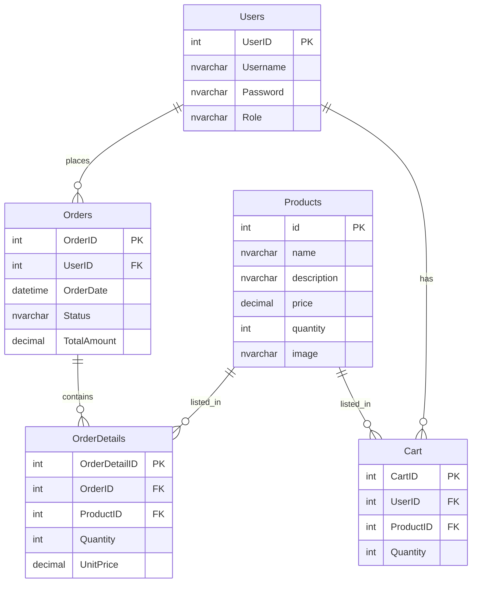

## 1. Architechture Projects

```
/src/
  ├── Controllers
  │     ├── CheckoutServlet.java
  │
  ├── Models
  │     ├── CartItem.java
  │     ├── Order.java
  │     ├── OrderItem.java
  │
  ├── DALs
  │     ├── ProductDAO.java
  │     ├── OrderDAO.java
  │
/webapp/
  ├── views/
  │     ├── pages/
  │     │     ├── products.jsp
  │     │     ├── cart.jsp
  │     │     ├── checkout.jsp

```

## SQL data:

```sql
CREATE DATABASE JSPShop;
GO

USE JSPShop;
GO

-- Product Table
CREATE TABLE Products (
    id INT PRIMARY KEY IDENTITY(1,1),
    name NVARCHAR(100) NOT NULL,
    description NVARCHAR(100),
    price decimal(10,2) NOT NULL,
    quantity int NOT NULL,
    image varchar(100)
);

-- Users Table
CREATE TABLE Users (
    UserID INT PRIMARY KEY IDENTITY(1,1),
    Username NVARCHAR(50) NOT NULL UNIQUE,
    Password NVARCHAR(255) NOT NULL,
    Role NVARCHAR(20) NOT NULL
);

CREATE TABLE Orders (
    OrderID INT IDENTITY(1,1) PRIMARY KEY,
    UserID INT NOT NULL FOREIGN KEY REFERENCES Users(UserID),
    OrderDate DATETIME DEFAULT GETDATE(),
    Status NVARCHAR(50) DEFAULT 'Pending',
    TotalAmount DECIMAL(12,2) NOT NULL
);

CREATE TABLE OrderDetails (
    OrderDetailID INT IDENTITY(1,1) PRIMARY KEY,
    OrderID INT NOT NULL FOREIGN KEY REFERENCES Orders(OrderID),
    ProductID INT NOT NULL FOREIGN KEY REFERENCES Products(id),
    Quantity INT NOT NULL,
    UnitPrice DECIMAL(10,2) NOT NULL
);

CREATE TABLE Cart (
    CartID INT IDENTITY(1,1) PRIMARY KEY,
    UserID INT NOT NULL FOREIGN KEY REFERENCES Users(UserID),
    ProductID INT NOT NULL FOREIGN KEY REFERENCES Products(id),
    Quantity INT NOT NULL
);

INSERT INTO Users (Username, Password, Role) VALUES
(N'admin', '123456x@X', N'ADMIN'),
(N'user', '123456x@X', N'CUSTOMER');

INSERT INTO Products (name, description, price, quantity, image)
VALUES
('Laptop Dell XPS 13', '13-inch Ultrabook with Intel i7 processor', 1299.99, 10, 'product1.jpg'),
('iPhone 15 Pro', 'Apple smartphone with A17 Bionic chip', 999.00, 20, 'product1.jpg'),
('Sony WH-1000XM5', 'Noise-cancelling wireless headphones', 349.99, 15, 'product1.jpg'),
('Logitech MX Master 3S', 'Ergonomic wireless mouse', 99.99, 30, 'product1.jpg'),
('Samsung 4K Monitor 27"', 'Ultra HD monitor with HDR support', 299.50, 12, 'product1.jpg');
```




