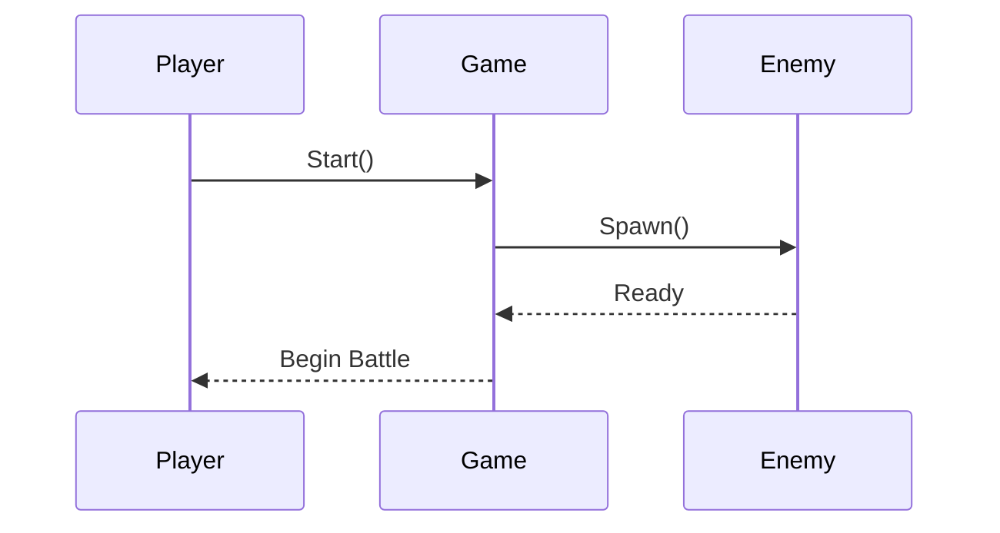
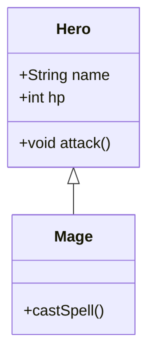

## 1. Project Structure





Create the following folder layout:
```
src/
├── model/
│   ├── Skill.java      // New
│   └── Hero.java       // Updated to support skills

```
## 2. Create Skill.java
Create the file: src/main/Main.java
``` java
package model;

public class Skill {
    private String name;
    private int power;
    private String description;

    public Skill(String name, int power, String description) {
        this.name = name;
        this.power = power;
        this.description = description;
    }

    public void use(Hero user, Hero target) {
        System.out.println(user.getName() + " uses " + name + " on " + target.getName() + "!");
        target.takeDamage(power);
    }

    public String getName() {
        return name;
    }

    public String getDescription() {
        return description;
    }

    public int getPower() {
        return power;
    }
}
```

## 3. Add `List<Skill>` to Hero

Update Hero.java to support a list of skills:

``` java 
import java.util.ArrayList;
import java.util.List;

public abstract class Hero {
    protected String name;
    protected int hp;
    protected int attack;
    protected List<Skill> skills;

    public Hero(String name, int hp, int attack) {
        this.name = name;
        this.hp = hp;
        this.attack = attack;
        this.skills = new ArrayList<>();
    }

    public void addSkill(Skill skill) {
        skills.add(skill);
    }

    public List<Skill> getSkills() {
        return skills;
    }

    public void useSkill(int index, Hero target) {
        if (index >= 0 && index < skills.size()) {
            skills.get(index).use(this, target);
        } else {
            System.out.println("Invalid skill index.");
        }
    }

    public void takeDamage(int damage) {
        this.hp -= damage;
        if (this.hp < 0) this.hp = 0;
        System.out.println(name + " now has " + hp + " HP.");
    }

    public String getName() {
        return name;
    }

    public int getHp() {
        return hp;
    }

    public abstract void attack(Hero target);
}
```

## 4. Update Warrior and Mage to add skills

### Warrior.java

```java
public class Warrior extends Hero {

    public Warrior(String name) {
        super(name, 150, 20);
        addSkill(new Skill("Heavy Strike", 30, "Deals powerful melee damage"));
    }

    @Override
    public void attack(Hero target) {
        System.out.println(name + " swings sword at " + target.getName() + " for " + attack + " damage.");
        target.takeDamage(attack);
    }
}
```

### Mage.java

```java
public class Mage extends Hero {

    public Mage(String name) {
        super(name, 100, 25);
        addSkill(new Skill("Fireball", 35, "Deals magic damage and burns"));
    }

    @Override
    public void attack(Hero target) {
        System.out.println(name + " launches magic at " + target.getName() + " for " + attack + " damage.");
        target.takeDamage(attack);
    }
}
```

## 5. Test in Main.java

```java 
import model.*;

public class Main {
    public static void main(String[] args) {
        Hero garen = new Warrior("Garen");
        Hero ahri = new Mage("Ahri");

        garen.attack(ahri);
        ahri.attack(garen);

        garen.useSkill(0, ahri);
        ahri.useSkill(0, garen);
    }
}
```
