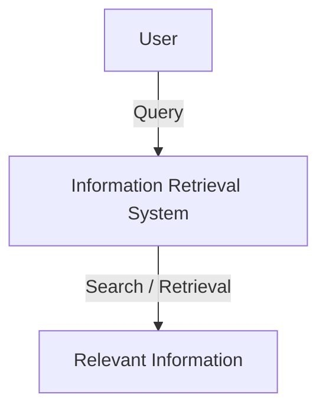
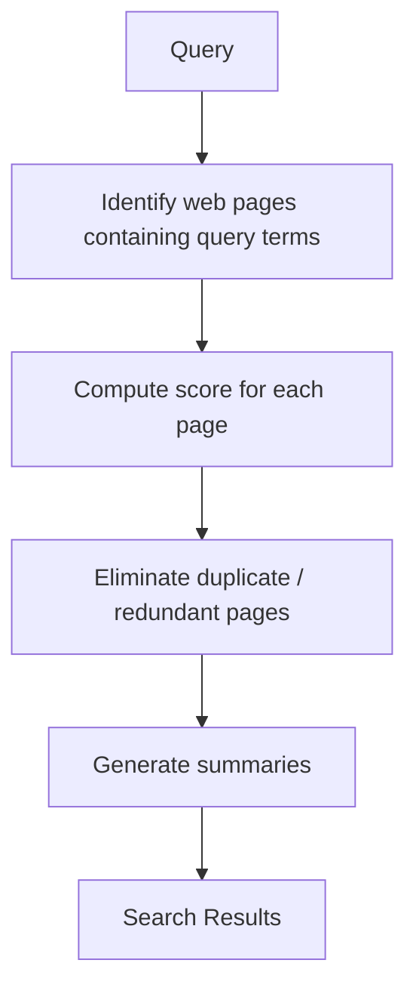
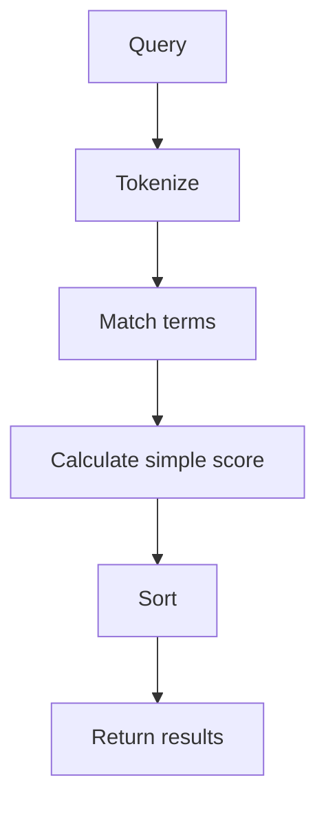
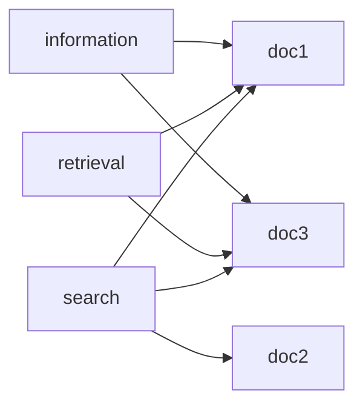

## 1. Learning Overview

Chapter 1 giới thiệu nền tảng của **Information Retrieval (IR)** và mối
quan hệ giữa IR với **Search Engine**.

Các nội dung chính:

1.  Information Retrieval
2.  Search Engines
3.  Search Engineers
4.  Web Search
5.  Other Search Applications
6.  Other Information Retrieval Applications

------------------------------------------------------------------------

## 2. Information Retrieval

### 2.1 Khái niệm

**Information Retrieval** liên quan đến:

-   Organization
-   Structure
-   Storage
-   Searching
-   Retrieval

Mục tiêu là tìm được thông tin phù hợp từ một kho thông tin dựa trên
**query** của người dùng.



> Một nhiệm vụ quan trọng của Information Retrieval là so sánh một "**piece of information**" hoặc query với thông tin được lưu trong một kho dữ liệu để tìm ra câu trả lời phù hợp.

## 3. Search Engine

### 3.1 Definition

**Search Engine** là ứng dụng thực tế của các kỹ thuật Information
Retrieval trên các tập hợp văn bản có quy mô lớn.

Các loại được đề cập:

-   Web Search Engine
-   Desktop Search Engine
-   Enterprise Search Engine

### 3.2 Compare Search Engine vs Information Retrieval

| **Information Retrieval (IR)**                                | **Search Engine**                  |
| ------------------------------------------------------------- | ---------------------------------- |
| Lĩnh vực/kỹ thuật xử lý tìm kiếm thông tin                    | Ứng dụng các kỹ thuật IR           |
| Tập trung vào **organization, storage, searching, retrieval** | Cung cấp hệ thống tìm kiếm thực tế |
| Có thể áp dụng trên nhiều loại dữ liệu                        | Thường phục vụ tập dữ liệu lớn     |
| Nền tảng lý thuyết/kỹ thuật                                   | Hệ thống ứng dụng                  |

## 4. Search Engineer

Search Engineer thường có nền tảng Computer Science, đặc biệt liên quan
đến Systems và Database.

Các nhiệm vụ chính:

-   Extend search engines
-   Maintain search engines
-   Tune existing search engines
-   Modify search engines
-   Design and implement new search engines
-   Optimize content for search engines
-   Deal with spam

Có thể hình dung lifecycle thực hành:


## 5. Web Search

### 5.1 Search Pipeline



1. Step 1 -- Query: Người dùng nhập truy vấn.

Ví dụ:

```
information retrieval search engine
```

2. Step 2 -- Identify Pages: Hệ thống xác định các web page có chứa các term liên quan đến query.

3. Step 3 -- Compute Score: Mỗi page được tính một score để xác định mức độ phù hợp.

```
relevance(document, query) -> score
```

4. Step 4 -- Remove Duplicates: Các kết quả trùng hoặc dư thừa được loại bỏ.

5. Step 5 -- Generate Summary: Hệ thống tạo summary cho các kết quả còn lại.

### Demo -- Simple Keyword Search

Ví dụ Python tối giản:

```python
documents = {
    1: "Information retrieval is about searching information",
    2: "Search engines use information retrieval techniques",
    3: "Database systems store structured information",
    4: "Web search engines process many queries"
}

query = "information retrieval"
terms = query.lower().split()

results = []

for doc_id, text in documents.items():
    text_lower = text.lower()

    score = sum(
        1 for term in terms
        if term in text_lower
    )

    if score > 0:
        results.append((doc_id, score, text))

results.sort(key=lambda x: x[1], reverse=True)

for doc_id, score, text in results:
    print(f"{score}: {text}")
```

Pipeline:



## 6. Other Search Applications

### 6.1 Desktop Search Engine

Desktop Search Engine cung cấp:

-   Search files
-   Browse files
-   Search trên local hard disk
-   Có thể tìm trên disk được kết nối qua local network

Hệ thống cần awareness về:

-   File format
-   Creation time

## 6.2 Enterprise Search Engine

Enterprise Search cung cấp:

-   Document management
-   Search services
-   Search trên dữ liệu trong tổ chức/doanh nghiệp

Một use case được đề cập là hỗ trợ yêu cầu retention của:

-   E-mail
-   Business communications
-   Documents

## 7. Other Information Retrieval Applications

### 7.1 Document Routing, Filtering and Selective Dissemination

Mục tiêu là phân phối hoặc lọc tài liệu dựa trên nhu cầu của người dùng.

- News Stream
- Filtering
- User Profile
- Relevant Articles

### 7.2 Text Clustering and Categorization

#### Clustering

Nhóm các document có nội dung tương tự.

```
Documents
   |
   +---- Politics
   |
   +---- Business
   |
   +---- Lifestyle
```

### Categorization

Gán document vào category đã xác định.

```
Article > Classification System >Business
```

### Demo -- Simple Extractive Summarization

```python
text = "Information retrieval is an important area of computer science. Search engines apply information retrieval techniques. A search engine processes user queries. The system retrieves relevant documents."

sentences = [
    s.strip()
    for s in text.split(".")
    if s.strip()
]

keywords = ["information", "search engine", "retrieves"]

scores = []

for sentence in sentences:
    score = sum(
        keyword in sentence.lower()
        for keyword in keywords
    )
    scores.append((score, sentence))

scores.sort(reverse=True)

for score, sentence in scores[:2]:
    print(sentence)
```

> Đây là mô hình minh họa đơn giản cho ý tưởng chọn các sentence quan
trọng.

# 8. Information Extraction Systems

Information Extraction nhằm:

1.  Identify named entities
2.  Extract information về entities
3.  Combine information thành structured records
4.  Describe relationships giữa entities

Ví dụ:

```text
"Google was founded by Larry Page and Sergey Brin."
```

Có thể biểu diễn:

```text
Organization:
    Google

Person:
    Larry Page
    Sergey Brin

Relationship:
    founded_by
```

Pipeline:

``` text
Unstructured Text > Entity Detection > Relation Extraction > Structured Data
```

------------------------------------------------------------------------

# 9. Topic Detection and Tracking

Topic Detection and Tracking nhằm:

-   Identify events trong news streams
-   Theo dõi các event
-   Theo dõi sự phát triển của event theo thời gian

```text
News 1 ─┐
News 2 ─┼──> Event A
News 3 ─┤
News 4 ─┘
       v
  Track Event
       v
News 5
News 6
```

# 10. Expert Search Systems

Expert Search System nhằm xác định các thành viên trong một tổ chức có
chuyên môn về một lĩnh vực cụ thể.

1. Step 1: Query: "Who is an expert in machine learning?"
2. Step 2: Expert Search
3. Step 3: Candidate Experts
4. Step 4: Expert Ranking

## 11. Question Answering Systems

Question Answering System tích hợp thông tin từ nhiều nguồn để cung cấp
câu trả lời ngắn gọn cho một câu hỏi cụ thể.

1. Question
2. Retrieve Information
3. Combine Information
4. Generate / Select Answer
5. Concise Answer

## 12. Multimedia Information Retrieval

Chapter cũng liệt kê **Multimedia Information Retrieval Systems**.

Có thể hình dung:
- Multimedia Collection: Text, Image, Audio, Video
- Information Retrieval

## 13. Summary 

  | Term                       | Meaning                                      | Example                         | Practice                 |
| -------------------------- | -------------------------------------------- | ------------------------------- | ------------------------ |
| **Information Retrieval**  | Tìm kiếm và truy xuất thông tin              | Search documents                | Keyword search           |
| **Search Engine**          | Hệ thống ứng dụng kỹ thuật IR                | Web search                      | Build mini search engine |
| **Query**                  | Truy vấn của người dùng                      | Query → Results                 | Query processing         |
| **Retrieval**              | Quá trình truy xuất thông tin                | Retrieve relevant documents     | Search pipeline          |
| **Relevance**              | Mức độ phù hợp giữa query và document        | Relevant documents              | Relevance scoring        |
| **Ranking**                | Sắp xếp kết quả theo score                   | Score documents                 | TF-IDF                   |
| **Web Search**             | Tìm kiếm thông tin trên web                  | Query → Results                 | Search pipeline          |
| **Desktop Search**         | Tìm kiếm dữ liệu trên máy tính               | Search local files              | File index               |
| **Enterprise Search**      | Tìm kiếm tài liệu trong doanh nghiệp         | Search company documents        | Document repository      |
| **Clustering**             | Gom nhóm dữ liệu tương tự                    | Politics / Business / Lifestyle | K-Means                  |
| **Categorization**         | Phân loại dữ liệu vào các nhóm               | Assign article category         | Text classification      |
| **Summarization**          | Tóm tắt nội dung                             | Long article → summary          | Extractive summary       |
| **Information Extraction** | Trích xuất thông tin có cấu trúc             | Entity extraction               | NER                      |
| **Topic Detection**        | Phát hiện topic/event                        | Detect emerging topics          | Topic classifier         |
| **Topic Tracking**         | Theo dõi topic/event                         | Follow news event               | Topic classifier         |
| **Expert Search**          | Tìm chuyên gia phù hợp                       | Find domain expert              | Profile ranking          |
| **Question Answering**     | Trả lời câu hỏi dựa trên thông tin truy xuất | Answer a question               | Retrieval + answer       |
| **Multimedia Retrieval**   | Tìm kiếm dữ liệu multimedia                  | Search images/videos            | Embedding-based search   |
| **Search Engineer**        | Kỹ sư phát triển/vận hành search system      | Build search infrastructure     | Indexing & ranking       |

------------------------------------------------------------------------

## 14. Suggested Mini Project -- Mini Search Engine

Mục tiêu: xây dựng search engine nhỏ cho tập document.

### Input

``` text
documents/
├── doc1.txt
├── doc2.txt
├── doc3.txt
└── ...
```

Ví dụ:

- doc1.txt

```
Information retrieval is the process of finding relevant information.
Search engines use information retrieval techniques.
```

- doc2.txt

```
Machine learning is widely used in modern artificial intelligence.
Search engines can use machine learning for ranking.
```

- doc3.txt

```
Information retrieval systems search documents and rank relevant results.
```

- doc4.txt

```
Database systems store and retrieve structured information.
```

### Pipeline

1. Documents
2. Text Processing
3. Index
4. Query
5. Matching
6. Scoring
7. Ranking
8. Results

- **Bước 1 — Documents**: Load tất cả .txt files.

```
documents/
    v
doc1.txt
doc2.txt
doc3.txt
doc4.txt
```

- **Bước 2 — Text Processing** Chuyển text thành dạng dễ tìm kiếm.

Ví dụ:

> "Information Retrieval is important"
> ["information", "retrieval", "is", "important"]

Có thể thực hiện:

```
- Lowercase
- Tokenization
- Remove punctuation
- Stop-word removal
```

- **Bước 3 — Index**: Tạo index đơn giản.

Ví dụ:

```
information > [doc1, doc3, doc4]
retrieval   > [doc1, doc3]
search      > [doc1, doc2, doc3]
machine     > [doc2]
```



### Requirements

Sinh viên cần thực hiện:

1. Load tất cả `.txt` files.
2. Đọc nội dung từng document.
3. Chuyển text về lowercase.
4. Tokenize document.
5. Xây dựng **Inverted Index**.
6. Nhận query từ người dùng.
7. Tokenize query.
8. Tìm các document chứa query terms.
9. Hiển thị danh sách matching documents.

### Phase 1 — Keyword Search

Xây dựng chức năng tìm kiếm cơ bản dựa trên **keyword matching**.

```python
import os
import re

DOCUMENT_DIR = "documents"


def tokenize(text):
    text = text.lower()
    return re.findall(r"\b[a-z]+\b", text)


def load_documents():
    documents = {}

    for filename in os.listdir(DOCUMENT_DIR):
        if filename.endswith(".txt"):
            path = os.path.join(DOCUMENT_DIR, filename)

            with open(path, "r", encoding="utf-8") as file:
                documents[filename] = file.read()

    return documents


def build_index(documents):
    index = {}

    for doc_id, text in documents.items():
        terms = tokenize(text)

        for term in terms:
            if term not in index:
                index[term] = set()

            index[term].add(doc_id)

    return index


def search(query, index):
    terms = tokenize(query)

    results = set()

    for term in terms:
        if term in index:
            results.update(index[term])

    return results


documents = load_documents()
index = build_index(documents)

query = input("Enter query: ")

results = search(query, index)

print("\nResults:")

for doc in results:
    print("-", doc)
```

### Phase 2 — Ranking

```python
from collections import Counter

def score_document(query, document):
    query_terms = tokenize(query)
    document_terms = tokenize(document)

    frequencies = Counter(document_terms)

    score = 0

    for term in query_terms:
        score += frequencies.get(term, 0)

    return score


def ranked_search(query, documents, index):
    candidates = search(query, index)

    results = []

    for doc_id in candidates:
        score = score_document(
            query,
            documents[doc_id]
        )

        results.append({
            "document": doc_id,
            "score": score
        })

    results.sort(
        key=lambda x: x["score"],
        reverse=True
    )

    return results
```