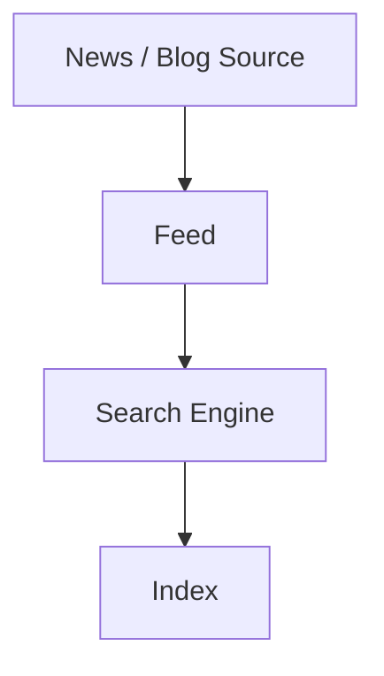
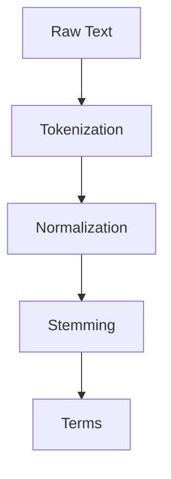
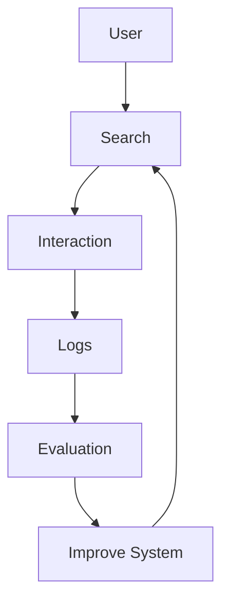

## 1. Search Engine Architecture – Big Picture

Một search engine có hai thành phần lớn:

```text
                 SEARCH ENGINE
                       |
          +------------+------------+
          |                         |
    INDEXING PROCESS          QUERY PROCESS
          |                         |
          v                         v
   Acquire Documents          User Query
          |                         |
   Transform Text          Query Transformation
          |                         |
    Create Index                Ranking
          |                         |
          +------------+------------+
                       |
                  Search Results
                       |
                   Evaluation
```


### Hai mục tiêu quan trọng

| Goal | Ý nghĩa |
|---|---|
| **Effectiveness** | Chất lượng của kết quả tìm kiếm |
| **Efficiency** | Tốc độ/hiệu quả sử dụng tài nguyên |

Một search engine tốt phải tìm được kết quả **đúng và hữu ích**, đồng thời xử lý query **hiệu quả**.

---

## 2. Information Retrieval System

**Information Retrieval System** xử lý query của người dùng để retrieve các document phù hợp từ document collection.


Có thể hiểu đơn giản:

> User muốn tìm thông tin => hệ thống xác định các document phù hợp => hệ thống trả về kết quả.

## 3. Indexing Process

Indexing process biến document collection thành một cấu trúc dữ liệu giúp search nhanh.

Bước chính:

1. **Text Acquisition**
2. **Text Transformation**
3. **Index Creation**
4. **User Interaction**
5. **Ranking**
6. **Evaluation**


---

## 4. Text Acquisition

### 4.1 Khái niệm

Text Acquisition là quá trình thu thập documents để đưa vào search engine.

- **Crawler**
- **Feed**
- Conversion
- Document data store

---

## 4.2 Crawler

Crawler là chương trình tự động traverses web để discover và download các web pages mới cho indexing.

```text
Web
 |
 +--> Page A
 |      |
 |      +--> Page B
 |             |
 |             +--> Page C
 |
 v
Crawler
 |
 v
Documents
```

### Crawler làm gì?

Một crawler về cơ bản:

1. Start URL
2. Download page
3. Extract links
4. Visit new links
5. Collect documents

### Demo: Extract Links

> Đây là demo đơn giản để minh họa concept crawler, không phải implementation crawler hoàn chỉnh.

```python
from urllib.request import urlopen
from html.parser import HTMLParser
from urllib.parse import urljoin


class LinkParser(HTMLParser):
    def __init__(self):
        super().__init__()
        self.links = []

    def handle_starttag(self, tag, attrs):
        if tag == "a":
            for key, value in attrs:
                if key == "href" and value:
                    self.links.append(value)


url = "https://example.com"

html = urlopen(
    url,
    timeout=5
).read().decode("utf-8", errors="ignore")

parser = LinkParser()
parser.feed(html)

for link in parser.links:
    print(urljoin(url, link))
```

Ý tưởng cần nhớ:

```text
Download > Parse > Extract Links > Discover
```

---

## 4.3 Feed

Feed cung cấp một **real-time stream of documents**.

Ví dụ source đề cập:
- News updates
- Blog posts
- RSS

Mô hình:



### Crawler vs Feed

| Crawler | Feed |
|---|---|
| Chủ động crawl web | Nhận/access stream documents |
| Discover pages qua links | Documents được cung cấp qua feed |
| Thường dùng cho web crawling | Phù hợp updates như news/blog |

## 4.4 Compression

 **Compression techniques** trong context của inverted-index storage.

Mục tiêu:
- Large Index
- Compression
- Smaller Storage
- Better Efficiency

## 5. Text Transformation

Raw document không phải lúc nào cũng sẵn sàng để indexing.

Text Transformation xử lý text để extract meaningful information.



Các concept quan trọng trong source:
- Unicode
- Tokenizer
- Stemming

### 5.1. Unicode

Unicode cung cấp cách biểu diễn characters từ nhiều languages.

Ví dụ:

```text
English:   Information
Vietnamese: Thông tin
Japanese:   情報
```

Search engine hỗ trợ nhiều ngôn ngữ cần xử lý text encoding/characters đúng cách.

### 5.2. Tokenizer

Tokenizer xác định và tách các individual words/terms từ text.

Ví dụ:

```text
Input:
Search engines process queries.

Output:
Search
engines
process
queries
```

**Examples:**

```python
text = "Search engines process queries."

tokens = (
    text
    .lower()
    .replace(".", "")
    .split()
)

print(tokens)
```

Output:

```text
['search', 'engines', 'process', 'queries']
```

> Đây là tokenizer đơn giản. Tokenization thực tế phụ thuộc language và loại dữ liệu.

### 5.3. Stemming

Stemming là quá trình reducing words về root/common form.

Ví dụ concept:

```text
computer
computers
computing
compute
```

> Đây là các **common stem** sử dụng cho mục đích tổng hợp kết quả
> Mục tiêu là giúp những word forms liên quan có thể được xử lý như một nhóm.

**Demo:**

```python
from nltk.stem import PorterStemmer

stemmer = PorterStemmer()

words = [
    "computer",
    "computers",
    "computing",
    "compute"
]

for word in words:
    print(word, "->", stemmer.stem(word))
```

## 6. Index Creation

Index Creation chuyển thông tin document-term thành index để hỗ trợ querying.

Core data structure trong source là:

> **Inverted Index**

### 6.1. Inverted Index

Inverted index mapping: **TERM to DOCUMENTS**

**Ví dụ:**

```text
D1: search engine
D2: information retrieval
D3: search information
```

**Index:**

```text
search       : [D1, D3]
engine       : [D1]
information  : [D2, D3]
retrieval    : [D2]
```

### 6.2 Tại sao cần inverted index?

Nếu không có index:

**Query > Scan D1 > Scan D2 > Scan D3 > ...**

Với inverted index:

> Query > Lookup term > Get document IDs

Do đó search engine không cần scan toàn bộ document collection cho mỗi query.

### 6.3. Demo: Build Inverted Index

```python
documents = {
    "D1": "search engine",
    "D2": "information retrieval",
    "D3": "search information"
}

index = {}

for doc_id, text in documents.items():

    terms = text.lower().split()

    for term in terms:
        index.setdefault(term, set()).add(doc_id)


for term, doc_ids in sorted(index.items()):
    print(term, "->", sorted(doc_ids))
```

Expected output:

```text
engine -> ['D1']
information -> ['D2', 'D3']
retrieval -> ['D2']
search -> ['D1', 'D3']
```

## 7. User Interaction

User Interaction cung cấp interface giữa user và search engine.

Các hoạt động quan trọng:
1. User
2. Query Input
3. Query Parsing
4. Query Processing
5. Results

User interaction bao gồm:

- Query input
- Query language interface
- Query parsing
- Search results

**Query input**

- Provides interface and parser for query language 
- Most web queries are very simple (few operators), other applications may use forms 
- Query language used to describe more complex queries and results of query transformation

> Query transformation nhằm cải thiện initial query.

**Các kỹ thuật được sử dụng:**

- Text transformation
- Spell checking
- Query expansion

**Ví dụ:**

- Original Query: "retrival system"
- Spell Checking: "retrieval system"
- Query expansion: Initial Query > Additional / related terms > Improved Query

## 8. Ranking

Ranking quyết định thứ tự documents trong search results.

1. Query
2. Candidate Documents
3. Scoring
4. Sorting
5. Ranked Results

Source mô tả ranking algorithms calculate document scores dựa trên:
- Query
- Document term weights

**Demo đơn giản**

```python
documents = {
    "D1": "search engine architecture",
    "D2": "information retrieval system",
    "D3": "search engine information retrieval"
}

query = "search engine"

terms = query.lower().split()

results = []

for doc_id, text in documents.items():

    words = text.lower().split()

    score = sum(
        words.count(term)
        for term in terms
    )

    results.append((doc_id, score))


results.sort(
    key=lambda item: item[1],
    reverse=True
)

for doc_id, score in results:
    print(doc_id, "score =", score)
```

**Ý tưởng:** Matching **Score** to Rank

### 8.1. PageRank

PageRank đo **importance of web pages** dựa trên:

- Number of links
- Quality of links

Ví dụ:

```text
Page A ─────> Page B
Page C ──────────┘
```

Page B nhận links từ A và C.

**Ý tưởng tổng quát:**

1. Web Graph
2. Link Analysis
3. Page Importance
4. PageRank Score

**Demo graph**

```python
graph = {
    "A": ["B", "C"],
    "B": ["C"],
    "C": ["A"]
}

for page, links in graph.items():
    print(page, "->", links)
```

## 9. Evaluation

Evaluation dùng để đánh giá search engine.

- Logging user interactions
- Analyzing ranking performance
- Measuring system efficiency

**Pipeline:**



Evaluation giúp search engineer biết:

- Ranking có tốt không?
- Search results có phù hợp không?
- Hệ thống có nhanh không?
- Cần cải thiện component nào?

### 9.1. Effectiveness

Tập trung vào **quality**.

Ví dụ: User Query Search - **Relevant Results?**

### 9.2 Efficiency

Tập trung vào **speed / resource usage**.

Ví dụ: Query Processing: **10 ms**

### So sánh:

| | Effectiveness | Efficiency |
|---|---|---|
| Focus | Quality | Speed |
| Question | Kết quả có tốt không? | Kết quả có nhanh không? |
| Related | Relevance / ranking | Processing / storage |


## Lab Exercise 1 – Inverted Index

Cho:

```python
documents = {
    "D1": "information retrieval",
    "D2": "search engine",
    "D3": "information search engine",
    "D4": "retrieval system"
}
```

Yêu cầu:

1. Tokenize documents.
2. Build inverted index.
3. Print index.
4. Tìm documents chứa `"information"`.
5. Tìm documents chứa `"search"`.
6. Tìm documents chứa `"engine"`.


## Lab Exercise 2 – Simple Search Engine

Xây dựng chương trình:

```text
flowchart TD
    A[Documents] --> B[Tokenizer]
    B --> C[Inverted Index]
    C --> D[User Query]
    D --> E[Candidate Documents]
    E --> F[Score]
    F --> G[Ranking]
    G --> H[Results]
```

Minimum requirements:

- Load documents.
- Build inverted index.
- Nhận query từ keyboard.
- Retrieve documents.
- Calculate simple score.
- Sort results.
- Display document IDs.

## Mini Project – Mini Search Engine

Xây dựng một search engine nhỏ bằng Python.

### Input

```text
documents/
├── doc1.txt
├── doc2.txt
├── doc3.txt
└── ...
```

### Suggested structure

```text
mini-search-engine/
│
├── documents/
│   ├── doc1.txt
│   ├── doc2.txt
│   └── doc3.txt
│
├── tokenizer.py
├── indexer.py
├── search.py
├── ranker.py
├── evaluator.py
└── main.py
```

**Ví dụ dữ liệu:**

- doc1.txt:

```
Python is a programming language.
Python is easy to learn.
```

- doc2.txt:

```
Search engines use an inverted index.
An index helps search documents quickly.
```

- doc3.txt

```
Python can be used to build a search engine.
Search is an important application of Python.
```

1. tokenizer.py: Text Transformation
2. indexer.py: Index Creation
3. search.py: Query Processing
4. ranker.py: Ranking
5. evaluator.py: Evaluation
6. main.py: User Interaction

**tokenizer.py**

```python
import re


def tokenize(text):
    """
    Convert text into normalized tokens.

    Steps:
    1. Lowercase
    2. Remove punctuation
    3. Split into words
    """

    text = text.lower()

    # Keep only letters and numbers
    text = re.sub(r"[^a-z0-9\s]", " ", text)

    tokens = text.split()

    return tokens
```

**indexer.py**: Xây dựng Inverted Index

```
python -> {doc1, doc3}
search -> {doc1, doc2}
engine -> {doc2, doc3}
```

```python
import os
from collections import defaultdict

from tokenizer import tokenize


class Indexer:

    def __init__(self):
        # term -> set(document)
        self.inverted_index = defaultdict(set)

        # document -> tokens
        self.documents = {}

    def index_documents(self, documents_path):
        """
        Read all .txt files and build inverted index.
        """

        for filename in os.listdir(documents_path):

            if not filename.endswith(".txt"):
                continue

            filepath = os.path.join(documents_path, filename)

            with open(filepath, "r", encoding="utf-8") as file:
                text = file.read()

            tokens = tokenize(text)

            self.documents[filename] = tokens

            for token in set(tokens):
                self.inverted_index[token].add(filename)

    def get_candidates(self, query_tokens):
        """
        Find documents containing at least
        one query term.
        """

        candidates = set()

        for token in query_tokens:
            candidates.update(
                self.inverted_index.get(token, set())
            )

        return candidates
```

**search.py**: Xử lý query của người dùng và tìm candidate documents.

```python
from tokenizer import tokenize


class SearchEngine:

    def __init__(self, indexer, ranker):
        self.indexer = indexer
        self.ranker = ranker

    def search(self, query):

        query_tokens = tokenize(query)

        # Find candidate documents
        candidates = self.indexer.get_candidates(query_tokens)

        # Rank candidates
        results = self.ranker.rank(
            query_tokens,
            candidates,
            self.indexer.documents
        )

        return results
```

**ranker.py**: sử dụng TF-IDF đơn giản.

```
import math
from collections import Counter


class Ranker:

    def __init__(self, total_documents):
        self.total_documents = total_documents

    def tf(self, term, document_tokens):
        """
        Term Frequency
        """

        counter = Counter(document_tokens)

        return counter[term] / len(document_tokens)

    def idf(self, term, documents):
        """
        Inverse Document Frequency
        """

        document_count = sum(
            1 for tokens in documents.values()
            if term in tokens
        )

        if document_count == 0:
            return 0

        return math.log(
            self.total_documents / document_count
        )

    def rank(self, query_tokens, candidates, documents):

        scores = {}

        for doc in candidates:

            doc_tokens = documents[doc]

            score = 0

            for term in query_tokens:

                if term not in doc_tokens:
                    continue

                tf = self.tf(term, doc_tokens)

                idf = self.idf(term, documents)

                score += tf * idf

            scores[doc] = score

        # Sort by score descending
        ranked_results = sorted(
            scores.items(),
            key=lambda x: x[1],
            reverse=True
        )

        return ranked_results
```

**evaluator.py**: Đánh giá kết quả search bằng Precision@K.

```python
def precision_at_k(results, relevant_documents, k=5):
    """
    Calculate Precision@K.

    results:
        [('doc1.txt', 0.8), ('doc2.txt', 0.4)]

    relevant_documents:
        {'doc1.txt', 'doc3.txt'}
    """

    top_k = results[:k]

    if not top_k:
        return 0

    relevant_count = 0

    for doc, score in top_k:

        if doc in relevant_documents:
            relevant_count += 1

    return relevant_count / len(top_k)
```

main.py: Chương trình chính để người dùng nhập query.

```python
from indexer import Indexer
from ranker import Ranker
from search import SearchEngine


DOCUMENTS_PATH = "documents"

def main():

    print("================================")
    print("       MINI SEARCH ENGINE")
    print("================================")

    # -----------------------------
    # 1. Build index
    # -----------------------------

    indexer = Indexer()

    indexer.index_documents(DOCUMENTS_PATH)

    print(
        f"\nIndexed {len(indexer.documents)} documents."
    )

    print(
        f"Vocabulary size: "
        f"{len(indexer.inverted_index)}"
    )

    # -----------------------------
    # 2. Create ranker
    # -----------------------------

    ranker = Ranker(
        total_documents=len(indexer.documents)
    )

    # -----------------------------
    # 3. Create search engine
    # -----------------------------

    search_engine = SearchEngine(
        indexer,
        ranker
    )

    # -----------------------------
    # 4. User interaction
    # -----------------------------

    while True:

        query = input("\nSearch (type 'exit' to quit): ")

        if query.lower() == "exit":
            break

        results = search_engine.search(query)

        print("\nResults:")

        if not results:
            print("No documents found.")
            continue

        for i, (doc, score) in enumerate(results, 1):

            print(
                f"{i}. {doc} "
                f"(score={score:.4f})"
            )


if __name__ == "__main__":
    main()
```