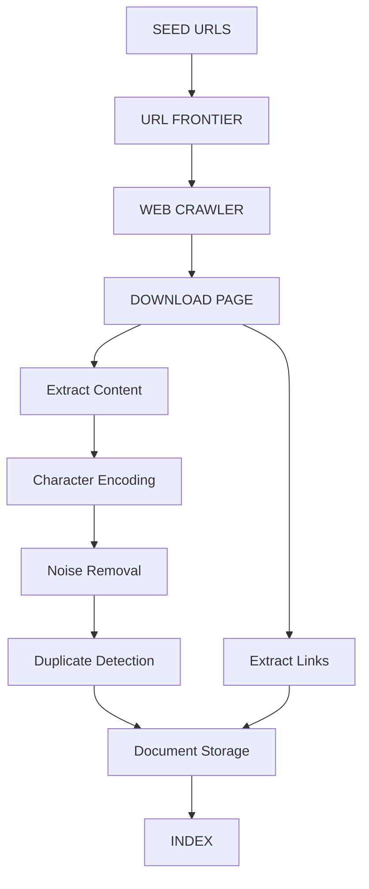

## 1. Learning Objectives

- Xác định các phương pháp crawl web pages và retrieve content.
- Phân biệt **push feed** và **pull feed**.
- Giải thích mục đích của **character encoding**.
- Mô tả kỹ thuật lưu trữ và truy xuất documents hiệu quả.
- Hiểu duplicate và near-duplicate detection.
- Giải thích fingerprinting.
- Nhận biết noise trên web pages.
- Hiểu content block detection.
- Triển khai một crawling algorithm cơ bản.

```text
Crawling and Feeds
│
├── Web Crawling
│   ├── Web Crawler
│   ├── Crawl process
│   └── Focused crawling
│
├── Document Feeds
│   ├── Push Feed
│   └── Pull Feed
│
├── Character Encoding
│
├── Document Storage
│
├── Duplicate Detection
│   ├── Duplicate
│   ├── Near-Duplicate
│   └── Fingerprinting
│
└── Noise Removal
    └── Content Block Detection
```

## 3. Web Crawling

**Web Crawling** là quá trình tìm và download web pages để xây dựng database cho search engine.

**Web Crawler** là chương trình kết nối tới web servers để tìm và download pages.

1. Seed URL
2. Download Page
3. Extract Links
4. New URLs
5. Download Pages
6. ...

**Basic crawler architecture**

```text
                +----------------+
                |   Seed URLs    |
                +-------+--------+
                        |
                        v
                +---------------+
                | URL Frontier  |
                +-------+-------+
                        |
                        v
                +---------------+
                | Web Crawler   |
                +-------+-------+
                        |
                        v
                  Download Page
                        |
              +---------+---------+
              |                   |
              v                   v
         Store Document      Extract Links
                                  |
                                  v
                            URL Frontier
```

Các bước cơ bản:

1. Có seed URLs.
2. Đưa URL vào frontier.
3. Lấy URL để crawl.
4. Download page.
5. Lưu document.
6. Extract links.
7. Đưa URL mới vào frontier.
8. Lặp lại.

```text
          WEB / FEEDS
              |
              v
       +--------------+
       | Acquisition  |
       +------+-------+
              |
       +------+-------+
       |              |
    Crawler         Feed
       |              |
       +------+-------+
              |
              v
       Character Encoding
              |
              v
         Noise Removal
              |
              v
      Duplicate Detection
              |
              v
       Document Storage
              |
              v
             Index
```

### 3.1. Crawl Politeness

Crawler phải chờ giữa các requests tới cùng web server để tránh overload server.

```text
Request => Wait => Request => Wait => Request
```

**Demo**

```python
import time
import requests

urls = [
    "https://example.com",
    "https://example.com/page1",
    "https://example.com/page2",
]

for url in urls:
    response = requests.get(url, timeout=10)
    print(url, response.status_code)
    time.sleep(2)
```

### 3.2. HTTP HEAD và Last Modification

Source đề cập **HTTP HEAD request** để kiểm tra last modification time của web page.

```text
Crawler
   |
   | HEAD
   v
Web Server
   |
   v
Last Modification Information
```

**Demo**

```python
import requests

url = "https://example.com"

response = requests.head(
    url,
    timeout=10,
    allow_redirects=True
)

print("Status:", response.status_code)
print("Last-Modified:", response.headers.get("Last-Modified"))
```

### 3.3. Focused Crawling

**Focused crawling** hướng crawler tới một số topics cụ thể nhằm cải thiện search accuracy.

Ví dụ search engine chuyên về AI:

```text
Artificial Intelligence
├── Machine Learning
├── Deep Learning
├── NLP
└── Computer Vision
```

Crawler ưu tiên pages liên quan tới topic thay vì crawl mọi content.

---

## 4. Document Feeds

**Document Feed** là sequence of documents được publish từ một source và được sắp xếp để retrieval.

Feeds có thể được dùng để acquire documents theo thời gian thực, chẳng hạn news updates hoặc blog posts.

```text
Document Source
      ↓
     Feed
      ↓
Search Engine
      ↓
Document Collection
```

---

### 4.1. Push Feed

**Push Feed** là feed alert subscribers khi có documents mới.

```text
Publisher
    |
    | New Document
    v
   Feed
    |
    | Notification
    v
Subscriber
```

Source dùng **RSS** làm ví dụ về push feed cho news và blog updates.

### 4.2. Pull Feed

**Pull Feed** yêu cầu subscriber tự kiểm tra định kỳ để tìm documents mới.

```text
Subscriber
    |
    | Check
    v
   Feed
    |
    | New Documents?
    v
Subscriber
```

**Demo**

```python
import time

while True:
    new_documents = check_feed()

    if new_documents:
        process(new_documents)

    time.sleep(60)
```

### 4.3. Push vs Pull Feed

| Push Feed | Pull Feed |
|---|---|
| Feed alerts subscriber | Subscriber chủ động kiểm tra |
| Có notification khi có document mới | Kiểm tra theo chu kỳ |
| RSS là ví dụ trong source | Periodic checking |

Cách nhớ:

```text
PUSH = "Có document mới => báo tôi"
PULL = "Để tôi tự kiểm tra"
```

## 5. Character Encoding

**Character Encoding** là mapping giữa bits và glyphs để biểu diễn text trên web pages.

Ví dụ:

```text
English:    Information
Vietnamese: Thông tin
Chinese:    信息
```

Source đề cập ASCII, CJK và Unicode trong context biểu diễn text.

Nếu encoding bị xử lý sai, text có thể trở thành ký tự lỗi:

```text
"Thông tin"
     |  Wrong decoding
     v  
"Thông tin"
```

### Demo UTF-8

```python
text = "Search Engine – Thông tin tìm kiếm"

data = text.encode("utf-8")
print(data)

decoded = data.decode("utf-8")
print(decoded)
```

## 6. Document Storage

**Document Storage** là phương pháp lưu documents ở format phù hợp cho indexing và retrieval.

```text
Downloaded Document
       +---- URL
       +---- Content
       +---- Metadata
       v
Document Storage
```

**Demo**

```python
documents = {}

urls = [
    "https://example.com/a",
    "https://example.com/b",
    "https://example.com/c"
]

for url in urls:
    key = hash(url)
    documents[key] = {
        "url": url,
        "content": "example content"
    }

for key, document in documents.items():
    print(key, document["url"])
```

## 7. Duplicate Detection

**Duplicate Detection** là quá trình xác định và loại bỏ duplicate content.

```text
URL A ─────┐
URL B ─────┼──> Same Page / Same Content
URL C ─────┘
```

Hai loại cần phân biệt:

- Exact duplicate
- Near-duplicate

### 7.1. Duplicate

Source định nghĩa duplicate là trường hợp multiple URLs trỏ tới cùng web page hoặc mirror sites tạo ra duplicate pages trong crawling.

Exact duplicate detection tương đối đơn giản và có thể dùng checksumming.

```text
Document > Checksum/Hash > Compare
```

**Demo**

```python
import hashlib

def fingerprint(text):
    return hashlib.sha256(
        text.encode("utf-8")
    ).hexdigest()


doc1 = "Information retrieval system"
doc2 = "Information retrieval system"
doc3 = "Search engine system"

print(fingerprint(doc1) == fingerprint(doc2))
```

Output:

```text
True
```

### 7.2. Near-Duplicate

**Near-Duplicate** là documents similar nhưng không identical.

Source nêu khác biệt có thể đến từ:

- Formatting
- Advertisements
- Dates

Source sử dụng ví dụ ngưỡng **90% of words in common**.

```text
D1:
Search engine architecture is important for information retrieval.

D2:
Search engine architecture is important for information retrieval.
Advertisement: Buy now!
```

### 7.3. Fingerprinting

**Fingerprinting** biểu diễn document bằng cách parse document, tạo n-grams, chọn n-grams và hash chúng để hỗ trợ duplicate detection.

1. Document
2. Parse
3. Words
4. N-grams
5. Select N-grams
6. Hash
7. Fingerprint

### 7.4. N-gram

N-gram là chuỗi gồm `n` elements liên tiếp.

Ví dụ:

```text
"search engines are useful"
```

Word 2-grams:

```text
search engines
engines are
are useful
```

**Demo**

```python
def ngrams(words, n):
    return [
        words[i:i+n]
        for i in range(len(words) - n + 1)
    ]


text = "search engines are useful"
words = text.split()

for gram in ngrams(words, 2):
    print(gram)
```

### 7.5. Demo: Simple Fingerprint

```python
import hashlib


def fingerprint(text, n=3):
    words = text.lower().split()

    grams = [
        " ".join(words[i:i+n])
        for i in range(len(words) - n + 1)
    ]

    return {
        hashlib.md5(
            gram.encode("utf-8")
        ).hexdigest()
        for gram in grams
    }


doc = "search engines retrieve relevant documents"
print(fingerprint(doc))
```

Hai documents có nhiều fingerprints giống nhau có thể là candidates cho near-duplicate detection.

## 8. Noise Removal

**Noise** là non-relevant content trên web page, ví dụ:

- Banners
- Advertisements
- Navigation links

```text
+--------------------------------+
| Banner                         |
+--------------------------------+
| Navigation                     |
+--------------------------------+
|                                |
|       Main Article             |
|                                |
+--------------------------------+
| Advertisement                  |
+--------------------------------+
| Footer                         |
+--------------------------------+
```

Noise removal nhằm xác định và loại bỏ các phần không liên quan.

---

### Content Block Detection

**Content Block Detection** xác định các sections của page có ít content, ví dụ banners hoặc advertisements.

Source đưa ra criterion:

```text
Content block < 20%
of display area
```

như một ví dụ trong lecture.

## 9. Complete Crawling Pipeline



---

## 10. Crawler vs Feed

| Feature | Crawler | Feed |
|---|---|---|
| Source | Web pages | Document stream |
| Acquisition | Discover/download | Receive/check documents |
| Main idea | Crawl web | Publish/access updates |
| Example | Web crawler | RSS |

---

## 11. Duplicate vs Near-Duplicate

| Duplicate | Near-Duplicate |
|---|---|
| Content giống nhau | Content rất giống nhưng có khác biệt |
| Multiple URLs/mirror | Ads, formatting, dates có thể khác |
| Checksumming có thể đủ | Fingerprinting/similarity hữu ích |

---

## 12. Fingerprinting vs Checksumming

```text
Exact Duplicate > Checksum / Hash > Compare
```

Trong khi:

```text
Near Duplicate > N-grams > Hash N-grams > Fingerprint > Compare Similarity
```

## 13. Mini Project – Web Crawler

Xây dựng một Web Crawler đơn giản bằng Python có khả năng:

1. Nhận một Seed URL.
2. Download web page.
3. Extract hyperlinks từ HTML.
4. Thêm các URL mới vào URL Frontier.
5. Crawl các URL chưa được crawl.
6. Giới hạn số lượng pages.
7. Không crawl cùng một URL nhiều lần.
8. Phát hiện exact duplicate bằng content fingerprint.
9. Lưu các documents đã crawl.
10. Hiển thị thông tin quá trình crawling.

**Project structure**

```text
mini-crawler/
├── crawler.py
├── parser.py
├── frontier.py
├── storage.py
├── duplicate.py
├── config.py
└── main.py
```

### config.py

```python
from collections import deque


class URLFrontier:

    def __init__(self):
        self.queue = deque()
        self.visited = set()

    def add(self, url):
        if url in self.visited:
            return False

        if url in self.queue:
            return False

        self.queue.append(url)
        return True

    def get(self):
        if not self.queue:
            return None

        return self.queue.popleft()

    def mark_visited(self, url):
        self.visited.add(url)

    def is_visited(self, url):
        return url in self.visited

    def empty(self):
        return len(self.queue) == 0

    def visited_count(self):
        return len(self.visited)
```

### frontier.py

URL Frontier chịu trách nhiệm quản lý các URL đang chờ crawl.

```python
from collections import deque

class URLFrontier:

    def __init__(self):
        self.queue = deque()
        self.visited = set()

    def add(self, url):
        if url in self.visited:
            return False

        if url in self.queue:
            return False

        self.queue.append(url)
        return True

    def get(self):
        if not self.queue:
            return None

        return self.queue.popleft()

    def mark_visited(self, url):
        self.visited.add(url)

    def is_visited(self, url):
        return url in self.visited

    def empty(self):
        return len(self.queue) == 0

    def visited_count(self):
        return len(self.visited)
```

### parser.py

Parser chịu trách nhiệm extract hyperlinks.

```python
from html.parser import HTMLParser
from urllib.parse import urljoin, urlparse

class LinkParser(HTMLParser):

    def __init__(self, base_url):
        super().__init__()
        self.base_url = base_url
        self.links = []

    def handle_starttag(self, tag, attrs):

        if tag != "a":
            return

        for key, value in attrs:

            if key == "href" and value:

                url = urljoin(
                    self.base_url,
                    value
                )

                parsed = urlparse(url)

                if parsed.scheme in {"http", "https"}:
                    self.links.append(url)


def extract_links(html, base_url):

    parser = LinkParser(base_url)

    parser.feed(html)

    return parser.links

```

**Ví dụ:**

```html
<a href="/news/1">News</a>
```

**Seed:**

```
https://example.com
```

**Kết quả:**

```
https://example.com/news/1
```

### duplicate.py

Exact duplicate sử dụng SHA-256.

```python
import hashlib

def fingerprint(content):

    return hashlib.sha256(
        content.encode("utf-8")
    ).hexdigest()


class DuplicateDetector:

    def __init__(self):
        self.fingerprints = set()

    def is_duplicate(self, content):

        fp = fingerprint(content)

        if fp in self.fingerprints:
            return True

        self.fingerprints.add(fp)

        return False

```

**Ví dụ:**

```
D1 = "hello world"
D2 = "hello world"
D3 = "hello world!"
```

**Fingerprint:**

```
D1 -> ABC123
D2 -> ABC123
D3 -> XYZ999
```

**Do đó:**

```
D1 == D2 -> Duplicate
D1 != D3 -> Not duplicate
```

### storage.py

Mỗi page được lưu thành một document.

```python 
import os
import hashlib

class DocumentStorage:

    def __init__(self, storage_dir="documents"):

        self.storage_dir = storage_dir

        os.makedirs(
            storage_dir,
            exist_ok=True
        )

    def save(self, url, content):

        document_id = hashlib.sha256(
            url.encode("utf-8")
        ).hexdigest()[:16]

        filename = os.path.join(
            self.storage_dir,
            f"{document_id}.html"
        )

        with open(
            filename,
            "w",
            encoding="utf-8"
        ) as file:

            file.write(content)

        return filename

```

**Ví dụ:**

```
documents/
├── a83f9123ab21.html
├── b8123d21ac91.html
├── 72a123ab9812.html
└── ...
```

### crawler.py

Đây là core của project.

```python
from urllib.request import Request, urlopen

import time

from frontier import URLFrontier
from parser import extract_links
from duplicate import DuplicateDetector
from storage import DocumentStorage

import config

class Crawler:

    def __init__(self):

        self.frontier = URLFrontier()

        self.duplicates = DuplicateDetector()

        self.storage = DocumentStorage(
            config.STORAGE_DIR
        )

    def download(self, url):

        request = Request(
            url,
            headers={
                "User-Agent": "MiniCrawler/1.0"
            }
        )

        response = urlopen(
            request,
            timeout=config.REQUEST_TIMEOUT
        )

        content_type = response.headers.get(
            "Content-Type",
            ""
        )

        if "text/html" not in content_type:
            return None

        content = response.read().decode(
            "utf-8",
            errors="ignore"
        )

        return content

    def crawl(self, seed_url, max_pages):

        self.frontier.add(seed_url)

        while (
            not self.frontier.empty()
            and self.frontier.visited_count() < max_pages
        ):

            url = self.frontier.get()

            if self.frontier.is_visited(url):
                continue

            print()
            print("Crawling:", url)

            try:

                content = self.download(url)

            except Exception as error:

                print(
                    "Error:",
                    error
                )

                self.frontier.mark_visited(url)

                continue

            self.frontier.mark_visited(url)

            if content is None:

                print(
                    "Skipped: not HTML"
                )

                continue

            if self.duplicates.is_duplicate(content):

                print(
                    "Duplicate:",
                    url
                )

                continue

            filename = self.storage.save(
                url,
                content
            )

            print(
                "Saved:",
                filename
            )

            links = extract_links(
                content,
                url
            )

            print(
                "Links:",
                len(links)
            )

            for link in links:

                self.frontier.add(link)

            time.sleep(
                config.CRAWL_DELAY
            )
```

### main.py

Entry point của chương trình:

```python
from crawler import Crawler
import config

def main():

    crawler = Crawler()

    crawler.crawl(
        config.SEED_URL,
        config.MAX_PAGES
    )


if __name__ == "__main__":
    main()
```

**Run**

```
python main.py
```

> **Good luck!!!**