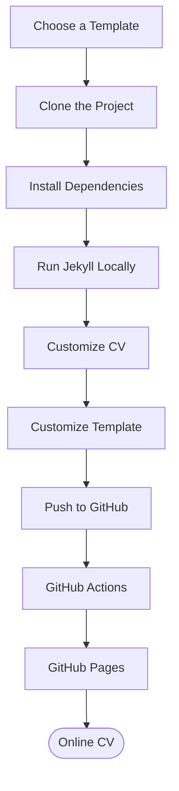
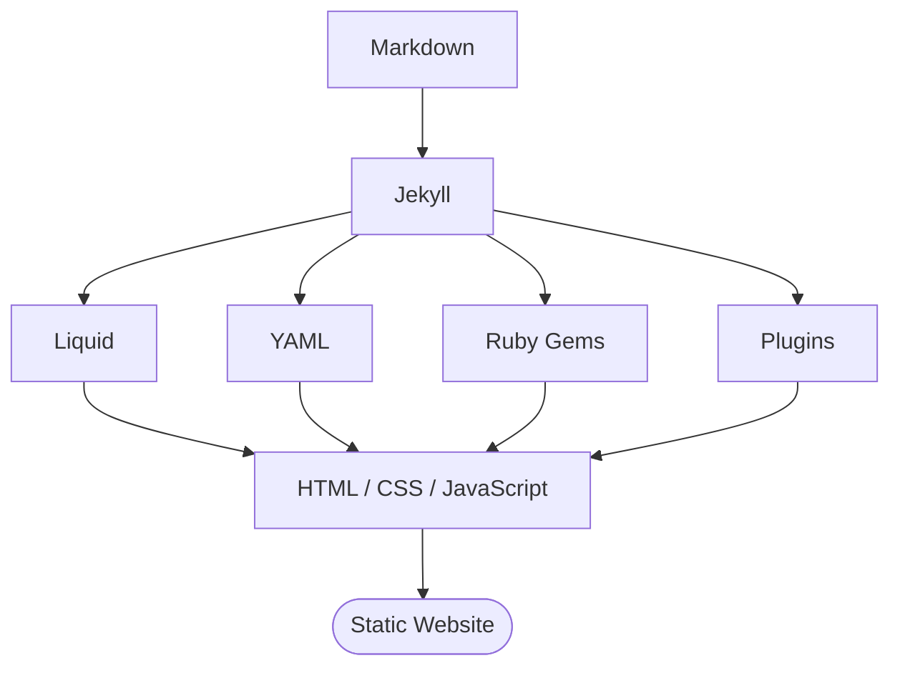

# Build Your CV with Ruby, Jekyll & GitHub Pages

## 1. Workshop Overview

### 1.1. Introduction

Xây dựng một **Personal CV Website** sử dụng Jekyll và triển khai website lên GitHub Pages.

Thay vì tạo toàn bộ website từ đầu, bạn sẽ sử dụng một **Jekyll CV Template** có sẵn, sau đó tùy chỉnh nội dung và giao diện theo CV cá nhân.

> **Mục tiêu là:**
> - Nhanh
> - Miễn phí
> - Dễ cập nhật

Quy trình tổng quát:



### 1.2. Prerequisites

* Kiến thức cơ bản về HTML, CSS, JS (Static Web)
* Biết sử dụng Git ở mức cơ bản (Có tài khoản GitHub)
* Có nội dung CV cá nhân hoặc các thông tin cần thiết để tạo CV.

## 2. Technologies

Workshop sử dụng các công nghệ sau:

| Technology     | Purpose                       |
| -------------- | ----------------------------- |
| Ruby           | Runtime cho Jekyll            |
| Jekyll         | Static Site Generator         |
| Liquid         | Template Language             |
| YAML           | Lưu trữ dữ liệu/configuration |
| HTML           | Cấu trúc website              |
| CSS            | Thiết kế giao diện            |
| Git            | Version Control               |
| GitHub         | Source Code Repository        |
| GitHub Actions | CI/CD                         |
| GitHub Pages   | Website Hosting               |

### 2.1. Ruby and Jekyll

**Ruby** là một programming language. **Jekyll** là một Static Site Generator được xây dựng bằng Ruby.


| Ưu điểm                     | Giải thích                                                                                   |
| --------------------------- | -------------------------------------------------------------------------------------------- |
| **Native với Jekyll**       | Jekyll được xây dựng bằng Ruby nên Ruby là môi trường chạy trực tiếp của Jekyll.             |
| **Cài đặt đơn giản**        | Jekyll được phân phối dưới dạng Ruby Gem, có thể cài đặt bằng `gem install jekyll`.          |
| **Gem ecosystem**           | Có thể sử dụng các Ruby Gem để mở rộng chức năng của Jekyll.                                 |
| **Liquid Template**         | Jekyll sử dụng Liquid để tạo template, kết hợp tốt với cấu trúc Ruby/Jekyll.                 |
| **Markdown + Ruby**         | Jekyll có thể kết hợp Markdown, Liquid, YAML và Ruby ecosystem trong cùng một project.       |
| **Plugin mạnh**             | Có thể sử dụng Jekyll Plugins viết bằng Ruby để mở rộng quá trình build website.             |
| **Build Static Site**       | Ruby/Jekyll xử lý nội dung và sinh ra HTML/CSS/JS tĩnh, không cần backend server khi deploy. |
| **Phù hợp GitHub Pages**    | Jekyll có integration rất tốt với GitHub Pages.                                              |
| **Configuration bằng YAML** | Jekyll sử dụng `_config.yml`, giúp cấu hình website tương đối rõ ràng.                       |
| **Automation tốt**          | Ruby ecosystem hỗ trợ tốt các tác vụ build, generate và transform nội dung.                  |



### 2.2. Liquid

**Liquid** là template language được Jekyll sử dụng để tạo nội dung động từ dữ liệu.

Ví dụ:

```liquid
<h1>{{ site.data.profile.name }}</h1>
```

Nếu file dữ liệu chứa:

```yaml
name: Nguyen Van A
```

Jekyll sẽ tạo HTML tương ứng:

```html
<h1>Nguyen Van A</h1>
```

### 2.3. YAML

**YAML** là format thường được sử dụng để lưu configuration và structured data.

Ví dụ:

```yaml
name: Nguyen Van A
title: Software Engineer
email: nguyenvana@gmail.com
```

Trong CV project, YAML có thể được sử dụng để lưu:

* Profile
* Skills
* Education
* Experience
* Projects

### 2.4. GitHub Pages

**GitHub Pages** là dịch vụ hosting static website của GitHub.

Source code được lưu trên GitHub repository và website được publish thành một URL.

Ví dụ:

```text
https://shandyprofile.github.io
```


### 2.5. GitHub Actions

**GitHub Actions** cho phép tự động thực hiện các công việc khi có thay đổi trong repository.

git push => GitHub Actions => Build Jekyll => Deploy => GitHub Pages

Điều này có nghĩa là sau khi bạn cập nhật CV và push code lên GitHub, website có thể được build và deploy tự động.

## 3. Find a Jekyll CV Template

### 3.1. Objective

Trong phần này, bạn sẽ tìm một Jekyll template có sẵn để sử dụng làm nền tảng cho CV.

Bạn không cần xây dựng toàn bộ giao diện từ đầu.

### 3.2. Search Keywords

Bạn có thể sử dụng các từ khóa sau:

```text
jekyll cv template
jekyll resume template
jekyll portfolio template
jekyll resume github
jekyll portfolio github
github pages resume
```

Bạn có thể tìm template trên GitHub hoặc các website cung cấp Jekyll themes.

### 3.3. Template Requirements (https://jekyllthemes.io/free)

Trước khi sử dụng một template, hãy kiểm tra:

- Jekyll
- Free / Open Source
- GitHub Pages compatible
- Responsive
- Có README
- Có License
- Có hướng dẫn cài đặt

Một Jekyll project thường có một số thành phần như:

```text
_config.yml
Gemfile
_layouts/
_includes/
assets/
```

Nếu repository không có cấu trúc Jekyll hoặc không có hướng dẫn rõ ràng, bạn nên chọn template khác.

### 3.4. Recommended Approach

Trong workshop, bạn nên sử dụng **một template đã được kiểm tra trước** để tránh các vấn đề về dependency hoặc GitHub Pages.

Nếu sử dụng template khác, hãy kiểm tra khả năng build local trước khi bắt đầu customize.

### 3.5 Find a Free Jekyll CV Template

Trong phần này, bạn sẽ tìm một Jekyll template miễn phí để sử dụng làm nền tảng xây dựng CV cá nhân.

Thay vì thiết kế toàn bộ website từ đầu, bạn sẽ:
- Find Template
- Check Template
- Open GitHub Repository
- Clone Template
- Customize


Trang này cung cấp danh sách các Jekyll themes miễn phí được chọn lọc từ cộng đồng open-source.

#### Step 1: Open the Free Jekyll Themes

Truy cập: [Jekyll Themes – Free Themes](https://jekyllthemes.io/free)

Trang Free Jekyll Themes hiển thị nhiều template Jekyll miễn phí với thông tin như:
- Theme name
- Mô tả ngắn
- GitHub stars
- Ngày cập nhật
- GitHub repository


Trang hiện có các theme dành cho nhiều mục đích khác nhau như personal website, portfolio, blog và resume/CV.

#### Step 2: Identify a CV / Resume Template

Không phải tất cả theme trên trang đều phù hợp để làm CV.

Bạn nên tìm những template có mô tả liên quan đến:
- Resume
- CV
- Personal Website
- Portfolio
- Personal Profile

Ví dụ, danh sách Free Jekyll Themes hiện có:
- Online CV – Minimal resume/CV theme
- Resume Template – GitHub Pages powered resume
- Beautiful – Simple personal website theme
- Freelancer – Landing page + portfolio
- Phantom – Minimalist, responsive portfolio theme


Trong đó Online CV và Resume Template là những lựa chọn trực tiếp hướng đến resume/CV.

#### Step 3: Select a Template

Khi tìm thấy một template phù hợp, click vào tên template để mở trang chi tiết.

Ví dụ: [Online CV](https://jekyllthemes.io/theme/online-cv)


Trang template mô tả đây là một minimal resume/CV theme, có thiết kế responsive và cung cấp nhiều color themes.

Bạn có thể xem:
- Template
- Description
- Preview
- GitHub Repository

#### Step 4: Check the Live Demo

Trước khi download template, hãy mở Live Demo (https://online-cv.webjeda.com/).

Mục đích là kiểm tra giao diện thực tế.

Bạn nên kiểm tra:
- Profile
- About
- Education
- Skills
- Experience
- Projects
- Contact
- Responsive layout


Hãy thử mở Live Demo trên (Right Mouse => Inspect => Devices):
- Desktop
- Tablet
- Mobile


#### Step 5: Check the Template Type

Không phải template nào có giao diện đẹp cũng phù hợp với workshop.

Ưu tiên template có: Jekyll + GitHub + GitHub Pages

Ví dụ Resume Template được mô tả trực tiếp là một **Jekyll + GitHub Pages powered resume template**.

#### Step 6 Open the GitHub Repository

Sau khi chọn template, tìm nút:

```
Get [Theme Name] on GitHub
```

hoặc:

```
GitHub
```

Ví dụ với Online CV, trang theme cung cấp liên kết đến GitHub repository của template.

Click vào GitHub repository.

Repository thường chứa source code của template. https://jekyllthemes.io/free

## 4. Install Ruby Environment

### 4.1. Objective

Cài đặt môi trường cần thiết để chạy Jekyll trên máy tính.

Download (https://www.ruby-lang.org/en/downloads/)


### 4.2. Check Ruby

Mở Terminal hoặc Command Prompt và chạy:

```bash
ruby --version
```

Ví dụ:

```text
ruby x.x.x
```

**Kiểm tra RubyGems:**

```bash
gem --version
```

**Kiểm tra Bundler:**

```bash
bundle --version
```

Nếu Bundler chưa được cài đặt:

```bash
gem install bundler
```

**Kiểm tra Jekyll:**

```bash
jekyll --version
```

Nếu Jekyll chưa được cài đặt:

```bash
gem install jekyll
```

### 4.3. Important Note

Nếu gặp lỗi khi cài Ruby/Jekyll, hãy kiểm tra phiên bản Ruby mà template yêu cầu trong:

```text
Gemfile
README.md
.github/workflows/
```

Không nên tự ý thay đổi phiên bản Ruby của project nếu chưa kiểm tra compatibility.

## 5. Clone the CV Template

### 5.1. Objective

Download source code của template về máy để bắt đầu customize.

### 5.2. Clone Repository

Sử dụng:

```bash
git clone <TEMPLATE_URL>
```

Ví dụ:

```bash
git clone https://github.com/sharu725/online-cv
```

Di chuyển vào project:

```bash
cd online-cv
```

Kiểm tra files:

```bash
ls
```

Trên Windows có thể sử dụng:

```cmd
dir
```

Bạn có thể thấy:

```text
_config.yml
Gemfile
_layouts
_includes
assets
index.md
README.md
```

## 6. Install Project Dependencies

### 6.1. Objective

Cài đặt các Ruby gems mà project yêu cầu.

Trong project directory, chạy:

```bash
bundle install
```

Bundler sẽ đọc:

```text
Gemfile
```

và cài đặt các dependencies cần thiết.

### 6.2. Gemfile

`Gemfile` chứa danh sách các Ruby dependencies của project.

Ví dụ:

```ruby
gem "jekyll"
gem "jekyll-seo-tag"
```

Bạn không cần thay đổi `Gemfile` nếu template đã hoạt động bình thường.

## 7. Run the Jekyll Website Locally

Chạy website trên máy tính trước khi deploy lên GitHub.

Sử dụng:

```bash
bundle exec jekyll serve
```

Nếu chạy thành công, terminal sẽ hiển thị địa chỉ tương tự:

```text
Server address: http://127.0.0.1:4000/
```

Mở trình duyệt:

```text
http://localhost:4000
```

**Development Workflow**

Trong quá trình customize:
1. Edit File
2. Save
3. Jekyll Rebuild
4. Refresh Browser

> Nên kiểm tra website local trước khi push code lên GitHub.

**Stop Jekyll Server**

Trong Terminal:

```text
Ctrl + C
```

## 8. Understand the Jekyll Project Structure

Một Jekyll CV project thường có cấu trúc tương tự:

```text
jekyll-cv/
├── _config.yml
├── _data/
├── _includes/
├── _layouts/
├── assets/
├── index.md
├── Gemfile
└── README.md
```

### 8.1. `_config.yml`

Chứa configuration của Jekyll website.

Ví dụ:

```yaml
title: My CV
description: Personal CV Website
url: "https://username.github.io"
```

> Update sau khi dang ky GitHub Page

### 8.2. `_data/`

Chứa structured data.

Ví dụ:

```text
_data/
├── profile.yml
├── education.yml
├── experience.yml
├── skills.yml
└── projects.yml
```

Đây thường là nơi bạn thay đổi **nội dung CV**.

### 8.3. `_layouts/`

Chứa các layout của website.

Ví dụ:

```text
_layouts/
├── default.html
└── cv.html
```

Layout xác định cấu trúc chung của page.

### 8.4. `_includes/`

Chứa các component HTML/Liquid có thể tái sử dụng.

Ví dụ:

```text
_includes/
├── header.html
├── about.html
├── education.html
├── experience.html
└── projects.html
```

### 8.5. `assets/`

Chứa các static assets:

```text
assets/
├── css/
├── js/
└── images/
```

Đây thường là nơi bạn customize:

* CSS
* JavaScript
* Images
* Fonts

### 8.6. `Gemfile`

Chứa Ruby dependencies của project.

## 9. Customize Your Profile

### 9.1. Objective

Thay thông tin mẫu trong template bằng thông tin cá nhân.

Vị trí chính xác của file phụ thuộc vào template bạn sử dụng.

Nếu template sử dụng `_data/data.yml`, mở:

```text
_data/data.yml
```

Ví dụ:

```yaml
position: right # position of the sidebar : left or right
  about: True # set to False or comment line if you want to remove the "how to use?" in the sidebar
  education: True # set to False if you want education in main section instead of in sidebar

  # Profile information
  name: Alan Doe
  tagline: Full Stack Developer
  avatar: profile.png #place a 100x100 picture inside /assets/images/ folder and provide the name of the file below

  # Sidebar links
  email: example@email.com
  phone: 012 345 6789
  timezone: America/Cancun # Enter your timezone, e.g., America/Havana, Africa/Casablanca, America/North_Dakota/Center
  citizenship:
  website: https://example.com/ # Include the full website URL, including "http://" or "https://".
  linkedin: alandoe
  xing: alandoe
  github: jekyll
  telegram: # add your nickname without '@' sign
  gitlab:
  bitbucket:
  bluesky: '@jekyllrb.bsky.social' # Specify your full Bluesky handle
  twitter: '@jekyllrb'
  stack-overflow: # Number/Username, e.g. 123456/alandoe
  codewars:
  goodreads: # Number-Username, e.g. 123456-alandoe
  mastodon: # Please include your full Mastodon link here.
  hackerrank: # Please provide your HackerRank username.
  leetcode: # Please provide your LeetCode username.
  pdf: # Add a PDF link here if you want to include a PDF custom version in your resume.
```

> Thay bằng thông tin của bạn. Nếu trường nào không muốn đưa thông tin thì set value là empty

## 10. Customize Skills

### 10.1. Objective

Liệt kê các technical skills liên quan đến vị trí bạn muốn ứng tuyển.

Ví dụ:

```
- career-profile: ...
- education: ...
- experiences: ...
- certifications: ...
- projects: ...
```

Nên ưu tiên:

```text
Skills relevant to target position
```

## 11. Understand Liquid Template

### 14.1. Objective

Hiểu cách Jekyll lấy dữ liệu và đưa vào HTML.

Ví dụ YAML:

```yaml
name: Nguyen Van A
```

Liquid:

```liquid
<h1>{{ site.data.profile.name }}</h1>
```

Output HTML:

```html
<h1>Nguyen Van A</h1>
```

### 14.2. Variables

Liquid sử dụng:

```liquid
{{ variable }}
```

Ví dụ:

```liquid
{{ site.title }}
```

### 14.3. Loop

Có thể sử dụng loop để render danh sách:

```liquid

    <li>{{ skill }}</li>

```

### 14.4. Condition

Có thể kiểm tra điều kiện:

```liquid

    <a href="https://github.com/{{ site.data.profile.github }}">
        GitHub
    </a>

```

## 12. Customize the Template

### 12.1. Objective

Sau khi hoàn thành nội dung, bạn có thể thay đổi giao diện template.

Có ba khu vực chính:
- Content: _data/
- Structure: _layouts/ + _includes/
- Style: assets/css/

### 12.2. Customize HTML

Các file cần kiểm tra:

```text
_layouts/
_includes/
```

Ví dụ:

```liquid
<h1>{{ site.data.profile.name }}</h1>
<h2>{{ site.data.profile.title }}</h2>
```

Bạn có thể thay đổi:

* HTML structure
* Section order
* Headings
* Buttons
* Links
* Components

### 12.3. Customize CSS

Tìm CSS files trong:

```text
assets/css/
```

Ví dụ:

```css
.profile-name {
    font-size: 42px;
}

.section-title {
    font-size: 24px;
}
```

Bạn có thể thay đổi:

* Font
* Font size
* Spacing
* Layout
* Width
* Border
* Background
* Responsive behavior

### 12.4. Customize Images

Nếu template hỗ trợ profile image, thường ảnh nằm trong:

```text
assets/images/
```

Ví dụ:

```text
assets/images/profile.png
```

Kiểm tra đường dẫn trong HTML/Liquid trước khi thay đổi tên file.

## 13. Test the Website

Trước khi deploy, chạy:

```bash
bundle exec jekyll serve
```

Mở:

```text
http://localhost:4000
```

Bạn cũng có thể kiểm tra build:

```bash
bundle exec jekyll build
```

Nếu build thành công, Jekyll sẽ tạo thư mục:

```text
_site/
```


`_site/` là static website được Jekyll generate.


## 14. Create Your GitHub Repository

### 14.1. Repository Name

Nếu muốn website có dạng:

```text
https://username.github.io
```

repository nên có tên:

```text
username.github.io
```

Ví dụ GitHub username là:

```text
nguyenvana
```

repository:

```text
nguyenvana.github.io
```


### 14.2. Initialize Git

**Trong project:**

```bash
git init
```

**Kiểm tra:**

```bash
git status
```

**Add Files**

```bash
git add .
```

**Commit**

```bash
git commit -m "Create personal CV website"
```

## 14.3 Push the Project to GitHub

**Thêm GitHub repository:**

```bash
git remote add origin https://github.com/username/username.github.io.git
```

**Kiểm tra:**

```bash
git remote -v
```

**Đặt branch:**

```bash
git branch -M main
```

**Push:**

```bash
git push -u origin main
```

Sau khi push thành công, source code sẽ xuất hiện trên GitHub repository.

## 15. Configure GitHub Pages

Vào repository: Settings => Pages


Chọn phương thức deployment phù hợp với workflow của project.

Nếu sử dụng GitHub Actions:
- Build and deployment
- Source
- GitHub Actions


Sau khi workflow chạy thành công, website sẽ được publish.

URL thường có dạng:

```text
https://username.github.io
```

## 16. Configure GitHub Actions (CICD)

Tự động build và deploy website mỗi khi bạn push code.

Workflow:
1. Edit CV
2. git add
3. git commit
4. git push
5. GitHub Actions
6. Jekyll Build
7. Deploy
8. GitHub Pages

**GitHub Actions workflow thường nằm trong:**

```text
.github/workflows/
```

Ví dụ:

```text
.github/
└── workflows/
    └── jekyll.yml
```

```yaml
name: Deploy Jekyll

on:
  push:
    branches:
      - main

jobs:
  build:
    runs-on: ubuntu-latest

    steps:
      - uses: actions/checkout@v4

      - uses: ruby/setup-ruby@v1
        with:
          ruby-version: '3.3'
          bundler-cache: true

      - run: bundle exec jekyll build

      - uses: actions/upload-pages-artifact@v3
        with:
          path: ./_site

  deploy:
    needs: build
    runs-on: ubuntu-latest

    permissions:
      pages: write
      id-token: write

    environment:
      name: github-pages

    steps:
      - uses: actions/deploy-pages@v4
```

> Lưu ý: Workflow có thể khác nhau tùy template và phiên bản Jekyll/Ruby. Nếu template đã cung cấp workflow, nên sử dụng workflow của template trước khi tự thay đổi.

## 17. Update Your CV

Sau khi website đã được deploy, quy trình cập nhật CV rất đơn giản.

### Step 1 — Edit

Ví dụ:

```text
_data/data.yml
_data/projects.yml
```

### Step 2 — Test

```bash
bundle exec jekyll serve
```

### Step 3 — Commit

```bash
git add .
git commit -m "Update CV"
```

### Step 4 — Push

```bash
git push
```

### Step 5 — Automatic Deployment

1. git push
2. GitHub Actions
3. Build
4. Deploy
5. Updated CV

> - Bạn không cần upload HTML thủ công lên server.
> - Các bước này không cần phải trực tiếp build và deploy.
> - Các bạn chỉ cần quan sát quá trình build và deploy tại Action trên GitHub


> Good luck. :D
